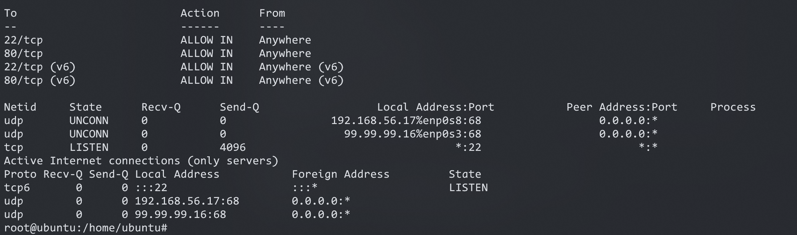
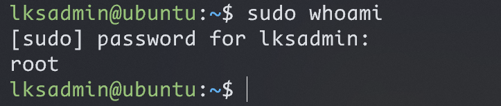
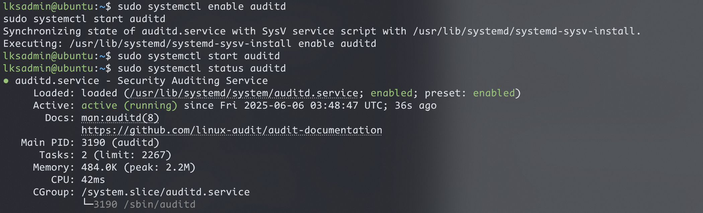
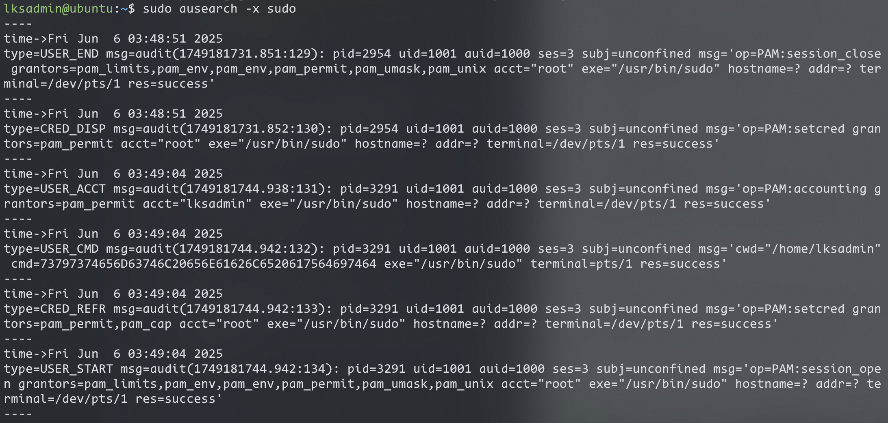
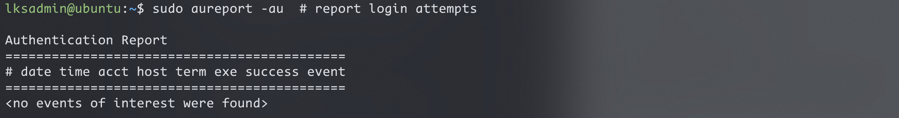
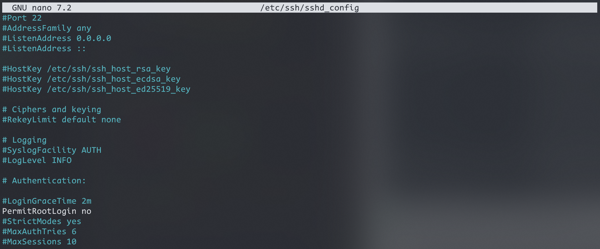
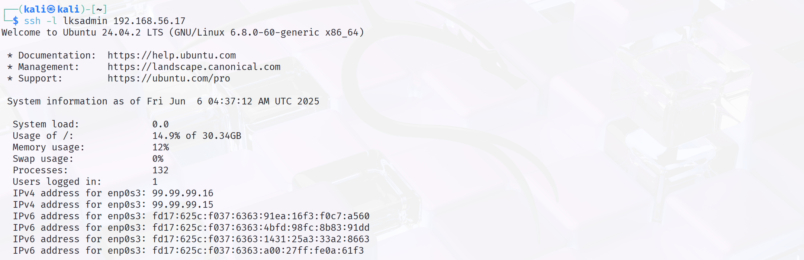
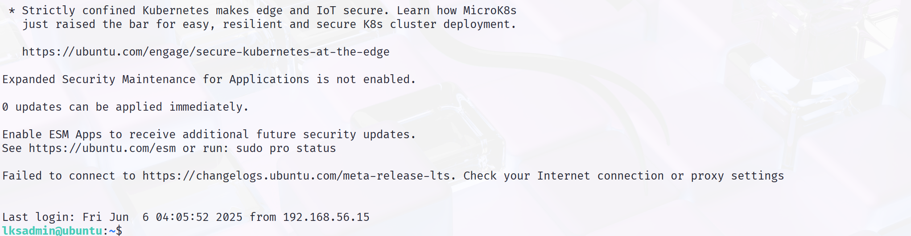

<!-- ===================== -->
<!--        METADATA       -->
<!-- ===================== -->

<h1 align="center">📄 Write-up Defensive Linux System</h1>

<p align="center">
  <strong>Dibuat oleh:</strong> <em>Adji Putra</em> <br>
  <strong>Tanggal Dibuat:</strong> <em>5 Juni 2025</em> <br>
  <strong>Tanggal Selesai:</strong> <em>5 Juni 2025</em> <br>
</p>

<hr>

<!-- ===================== -->
<!--       DAFTAR ISI      -->
<!-- ===================== -->

<h2 align="center">📚 Daftar Isi</h2>


<ol>
  <li><a href="#Pendahuluan">Pendahuluan</a></li>
  <li><a href="#Lingkungan Pengujian">Lingkungan Pengujian</a></li>
  <li><a href="#Tujuan">Tujuan</a></li>
  <li><a href="#Hardening">Hardening</a></li>
  <li><a href="#Pengujian Hardening">Pengujian Hardening</a></li>
   <li><a href="#Hasil Pengujian">Hasil Pengujian</a></li>
  <li><a href="#Analisa Intrusion Detection System (IDS) - Snort">Analisa Intrusion Detection System (IDS) - Snort</a></li>
  <li><a href="#kesimpulan">Kesimpulan</a></li>
  <li><a href="#lampiran">Lampiran</a></li>
</ol>

---

## 🔰 1. Pendahuluan<a name="Pendahuluan"></a>

Write-up Defensive 

---

## 🧪 2. Lingkungan Pengujian<a name="Lingkungan Pengujian"></a>

- OS: Ubuntu Server 24.04.2 LTS
- Hypervisor: VirtualBox
- Mode Jaringan: NAT & Host-Only

---

## 🎯 3. Tujuan<a name="Tujuan"></a>

Mengetahui cara bertahan dari serangan non-etika hacker

---

## 🔐 4. Hardening<a name="Hardening"></a>

<ol>
  <li>Mengamankan Port</li>
  <li>Membuat User</li>
  <li>Mengaktifkan Audit (auditd)</li>
  <li>Disable Root Login via SSH</li>
  <li>Login Menggunakan SSH-Key</li>
</ol>


---

## 🧾 5. Pengujian Hardening<a name="Pengujian Hardening"></a>

### ✅ Tahap 1: Mengamankan Port

#### 🔧 Tools yang Dipakai

- 🛡️ `ufw` (Uncomplicated Firewall)  
- 📡 `netstat` atau `ss` → cek port  
- 🧪 `nmap` → testing dari luar

---

#### 💡 Kenapa?  
Kita harus **matiin semua service yang gak penting**, biar **attack surface makin sempit**.  
🔓 **Port yang kebuka = pintu masuk serangan.**
**[Ubuntu]**
```Terminal

# 1. Aktifkan ufw
sudo ufw enable

# 2. Default deny semua
sudo ufw default deny incoming
sudo ufw default allow outgoing

# 3. Allow yang perlu (misalnya SSH port 22, HTTP port 80)
sudo ufw allow 22/tcp
sudo ufw allow 80/tcp

# 4. Cek status
sudo ufw status verbose

# 5. Cek service yang running dan port terbuka
sudo ss -tuln
# atau
sudo netstat -tuln

```
🚀 **Tujuan**:
- Biar cuma port tertentu doang yang bisa diakses.
- Misalnya port 3306 (MySQL) harusnya private? Jangan dibuka ke publik.
<br></br>

### ✅ Tahap 2: Membuat User

#### 🔧 Tools:
- `adduser`
- `usermod`
- `sudo`

#### 💡 Kenapa?
- **Root** punya akses full, jangan dipakai buat harian.
- Kita bikin user biasa + kasih dia akses `sudo` (admin level tapi ada jejaknya).
**[Ubuntu]**
```Terminal

# 1. Tambahkan user baru
sudo adduser lksadmin

# 2. Tambahkan ke grup sudo
sudo usermod -aG sudo lksadmin

# 3. Coba login pake user itu
su - lksadmin
sudo whoami   # harusnya output: root

```
🚀 **Tujuan**:
- Akses root tetap ada, tapi operasional harian pake user terbatas.
- Supaya kalo user ini bobol, damage-nya terbatas.
<br></br>

### ✅ Tahap 3: Mengaktifkan Audit (auditd)

#### 🔧 Tools:
- `auditd` (Audit Daemon)
- `ausearch`, `auditctl`

#### 💡 Kenapa?
- Biar semua aktivitas penting ke-log: login, akses file penting, penggunaan sudo, dsb.
**[Ubuntu]**
```Terminal

# 1. Install auditd
sudo apt update
sudo apt install auditd audispd-plugins

# 2. Aktifkan dan jalankan service
sudo systemctl enable auditd
sudo systemctl start auditd

# 3. Cek status
sudo systemctl status auditd

# 4. Coba lihat log audit
sudo ausearch -x sudo
sudo aureport -au  # report login attempts

```
🚀 **Tujuan**:
- Kalau ada serangan/aktivitas aneh, bisa dilacak via audit log.
- Cocok buat forensik & analisis pelanggaran.
<br></br>

### ✅ Bonus Step 4: Disable Root Login via SSH
#### 💡 Kenapa?
- Akses root langsung lewat SSH = bad practice. Gunakan user biasa + sudo
**[Ubuntu]**
```Terminal

sudo nano /etc/ssh/sshd_config

# Cari baris:
PermitRootLogin yes
# Ganti jadi:
PermitRootLogin no

# Restart SSH service
sudo systemctl restart ssh

```
🚀 **Tujuan**:
- Supaya vm lain yang ingin mengakses vm saya via ssh tidak bisa langsung naik jabatannya, ibarat one piece musuhnya luffy im-sama `(/root)` cukup menjadi holly knight/gorosei saja `(/home/user)`
<br></br>

### ✅ Bonus Step 5: Login Menggunakan SSH-Key tanpa Autentifkasi Password (Lebih Aman)
#### 💡 Kenapa?
- Karena kalo misalnya menggunakan password saja rawan untuk kena `brute force` password ssh untuk masuk kedalam sistem
**[Ubuntu]**
```Terminal

# Disisi Client, Misal Kali Linux atau Distro Linux Lainnya
ssh-keygen -t rsa -b 4096

```
**Output**:
Enter file in which to save the key (/home/kali/.ssh/id_rsa): [ENTER]
Enter passphrase (empty for no passphrase): [ENTER] atau isi kalau mau

#### File yang dihasilkan:
`~/.ssh/id_rsa (private key)` → **JANGAN DIBAGIKAN**
`~/.ssh/id_rsa.pub (public key)` → **YANG AKAN DIKIRIM KE SERVER**

#### Cara Membagikan Public Key ke VM Lain: 
Misal Client (Pembuat SSH-Key) membagikan Kunci Public Key nya ke vm lain agar Client bisa mengakses vm tersebut tanpa menggunakan Password. 
Cara gampang:
**[Ubuntu]**
```Terminal

ssh-copy-id -i ~/.ssh/id_rsa.pub username@IP-ubuntu-server

Contoh:
ssh-copy-id -i ~/.ssh/id_rsa.pub lksadmin@192.168.56.110

```

#### 📌 Kalau `ssh-copy-id` gak ada, bisa manual:
**[Ubuntu]**
```Terminal

cat ~/.ssh/id_rsa.pub | ssh lksadmin@192.168.56.110 "mkdir -p ~/.ssh && cat >> ~/.ssh/authorized_keys && chmod 600 ~/.ssh/authorized_keys"

```

#### 🔧 Pastikan Permission-nya Bener di Server atau VM lain
Login ke Ubuntu Server, lalu:
**[Ubuntu]**
```Terminal

chmod 700 ~/.ssh
chmod 600 ~/.ssh/authorized_keys # sesuaikan nama file enkripsinya apa didalam folder .ssh nya, default namenya adalah authorized_keys

```

#### 🔧 Edit Konfigurasi SSH di Server (Ubuntu)
**[Ubuntu]**
```Terminal

# Edit konfigurasi ssh
sudo nano /etc/ssh/sshd_config

```

Pastikan nilai berikut:
```Terminal

PasswordAuthentication no
PubkeyAuthentication yes
PermitRootLogin no

```

## 🧾 6. Hasil Pengujian<a name="Hasil Pengujian"></a>

##### ✅ Tahap 1: Mengamankan Port


##### ✅ Tahap 2: Membuat User



##### ✅ Tahap 3: Mengaktifkan Audit (auditd)




##### ✅ Bonus Step 4: Disable Root Login via SSH


##### ✅ Bonus Step 5: Login Menggunakan SSH-Key tanpa Autentifkasi Password (Lebih Aman)




---

## 🔐 7. Analisa Intrusion Detection System (IDS) - Snort<a name="Analisa Intrusion Detection System (IDS) Snort"></a>

lanjut

## 🧾 8. Pengujian IDS<a name="Pengujian IDS"></a>

```Terminal


```


## 🧠 . Kesimpulan <a name="Kesimpulan"></a>

Server berhasil di-hardening sesuai best practices…

---

## 📎 . Lampiran <a name="Lampiran"></a>

- Screenshot
- Log hasil uji
- Script konfigurasi

---

<p align="center"><em>Dokumentasi ini dibuat dengan semangat open source ❤️</em></p>

