<!-- ===================== -->
<!--        METADATA       -->
<!-- ===================== -->

<h1 align="center">📄 Write-up Defensive Linux System</h1>

<p align="center">
  <strong>Dibuat oleh:</strong> <em>Adji Putra</em> <br>
  <strong>Tanggal Dibuat:</strong> <em>6 Juni 2025</em> <br>
  <strong>Tanggal Selesai:</strong> <em>6 Juni 2025</em> <br>
</p>

<hr>

<!-- ===================== -->
<!--       DAFTAR ISI      -->
<!-- ===================== -->

<h2 align="center">📚 Daftar Isi</h2>


<ol>
  <li><a href="#Pendahuluan">Pendahuluan</a></li>
  <li><a href="#Lingkungan Pengujian">Lingkungan Pengujian</a></li>
  <li><a href="#Tujuan">Tujuan</a></li>
  <li><a href="#Hardening">Hardening</a></li>
  <li><a href="#Pengujian Hardening">Pengujian Hardening</a></li>
  <li><a href="#Hasil Pengujian Hardening">Hasil Pengujian Hardening</a></li>
  <li><a href="#Analisa Intrusion Detection System (IDS) - Snort">Analisa Intrusion Detection System (IDS) - Snort</a></li>
  <li><a href="#Pengujian Snort">Pengujian Snort</a></li>
  <li><a href="#Hasil Pengujian IDS">Hasil Pengujian IDS</a></li>
  <li><a href="#kesimpulan">Kesimpulan</a></li>
  <li><a href="#lampiran">Lampiran</a></li>
</ol>

---

## 🔰 1. Pendahuluan<a name="Pendahuluan"></a>

Write-up Defensive 

---

## 🧪 2. Lingkungan Pengujian<a name="Lingkungan Pengujian"></a>

- OS: Ubuntu Server 24.04.2 LTS
- Hypervisor: VirtualBox
- Mode Jaringan: NAT & Host-Only

---

## 🎯 3. Tujuan<a name="Tujuan"></a>

Mengetahui cara bertahan dari serangan non-etika hacker

---

## 🔐 4. Hardening<a name="Hardening"></a>

<ol>
  <li>Mengamankan Port</li>
  <li>Membuat User</li>
  <li>Mengaktifkan Audit (auditd)</li>
  <li>Disable Root Login via SSH</li>
  <li>Login Menggunakan SSH-Key</li>
</ol>


---

## 🧾 5. Pengujian Hardening<a name="Pengujian Hardening"></a>

### ✅ Tahap 1: Mengamankan Port

#### 🔧 Tools yang Dipakai

- 🛡️ `ufw` (Uncomplicated Firewall)  
- 📡 `netstat` atau `ss` → cek port  
- 🧪 `nmap` → testing dari luar

---

#### 💡 Kenapa?  
Kita harus **matiin semua service yang gak penting**, biar **attack surface makin sempit**.  
🔓 **Port yang kebuka = pintu masuk serangan.**
**[Ubuntu]**
```Terminal
# 1. Aktifkan ufw
sudo ufw enable

# 2. Default deny semua
sudo ufw default deny incoming
sudo ufw default allow outgoing

# 3. Allow yang perlu (misalnya SSH port 22, HTTP port 80)
sudo ufw allow 22/tcp
sudo ufw allow 80/tcp

# 4. Cek status
sudo ufw status verbose

# 5. Cek service yang running dan port terbuka
sudo ss -tuln
# atau
sudo netstat -tuln
```
🚀 **Tujuan**:
- Biar cuma port tertentu doang yang bisa diakses.
- Misalnya port 3306 (MySQL) harusnya private? Jangan dibuka ke publik.
<br></br>

### ✅ Tahap 2: Membuat User

#### 🔧 Tools:
- `adduser`
- `usermod`
- `sudo`

#### 💡 Kenapa?
- **Root** punya akses full, jangan dipakai buat harian.
- Kita bikin user biasa + kasih dia akses `sudo` (admin level tapi ada jejaknya).
**[Ubuntu]**
```Terminal
# 1. Tambahkan user baru
sudo adduser lksadmin

# 2. Tambahkan ke grup sudo
sudo usermod -aG sudo lksadmin

# 3. Coba login pake user itu
su - lksadmin
sudo whoami   # harusnya output: root
```
🚀 **Tujuan**:
- Akses root tetap ada, tapi operasional harian pake user terbatas.
- Supaya kalo user ini bobol, damage-nya terbatas.
<br></br>

### ✅ Tahap 3: Mengaktifkan Audit (auditd)

#### 🔧 Tools:
- `auditd` (Audit Daemon)
- `ausearch`, `auditctl`

#### 💡 Kenapa?
- Biar semua aktivitas penting ke-log: login, akses file penting, penggunaan sudo, dsb.
**[Ubuntu]**
```Terminal
# 1. Install auditd
sudo apt update
sudo apt install auditd audispd-plugins

# 2. Aktifkan dan jalankan service
sudo systemctl enable auditd
sudo systemctl start auditd

# 3. Cek status
sudo systemctl status auditd

# 4. Coba lihat log audit
sudo ausearch -x sudo
sudo aureport -au  # report login attempts
```
🚀 **Tujuan**:
- Kalau ada serangan/aktivitas aneh, bisa dilacak via audit log.
- Cocok buat forensik & analisis pelanggaran.
<br></br>

### ✅ Bonus Step 4: Disable Root Login via SSH
#### 💡 Kenapa?
- Akses root langsung lewat SSH = bad practice. Gunakan user biasa + sudo
**[Ubuntu]**
```Terminal
sudo nano /etc/ssh/sshd_config

# Cari baris:
PermitRootLogin yes
# Ganti jadi:
PermitRootLogin no

# Restart SSH service
sudo systemctl restart ssh
```
🚀 **Tujuan**:
- Supaya vm lain yang ingin mengakses vm saya via ssh tidak bisa langsung naik jabatannya, ibarat one piece musuhnya luffy im-sama `(/root)` cukup menjadi holly knight/gorosei saja `(/home/user)`
<br></br>

### ✅ Bonus Step 5: Login Menggunakan SSH-Key tanpa Autentifkasi Password (Lebih Aman)
#### 💡 Kenapa?
- Karena kalo misalnya menggunakan password saja rawan untuk kena `brute force` password ssh untuk masuk kedalam sistem
**[Ubuntu]**
```Terminal
# Disisi Client, Misal Kali Linux atau Distro Linux Lainnya
ssh-keygen -t rsa -b 4096
```
**Output**:
Enter file in which to save the key (/home/kali/.ssh/id_rsa): [ENTER]
Enter passphrase (empty for no passphrase): [ENTER] atau isi kalau mau

#### File yang dihasilkan:
`~/.ssh/id_rsa (private key)` → **JANGAN DIBAGIKAN**
`~/.ssh/id_rsa.pub (public key)` → **YANG AKAN DIKIRIM KE SERVER**

#### Cara Membagikan Public Key ke VM Lain: 
Misal Client (Pembuat SSH-Key) membagikan Kunci Public Key nya ke vm lain agar Client bisa mengakses vm tersebut tanpa menggunakan Password. 
Cara gampang:
**[Ubuntu]**
```Terminal
ssh-copy-id -i ~/.ssh/id_rsa.pub username@IP-ubuntu-server

Contoh:
ssh-copy-id -i ~/.ssh/id_rsa.pub lksadmin@192.168.56.110
```

#### 📌 Kalau `ssh-copy-id` gak ada, bisa manual:
**[Ubuntu]**
```Terminal
cat ~/.ssh/id_rsa.pub | ssh lksadmin@192.168.56.110 "mkdir -p ~/.ssh && cat >> ~/.ssh/authorized_keys && chmod 600 ~/.ssh/authorized_keys"
```

#### 🔧 Pastikan Permission-nya Bener di Server atau VM lain
Login ke Ubuntu Server, lalu:
**[Ubuntu]**
```Terminal
chmod 700 ~/.ssh
chmod 600 ~/.ssh/authorized_keys # sesuaikan nama file enkripsinya apa didalam folder .ssh nya, default namenya adalah authorized_keys
```

#### 🔧 Edit Konfigurasi SSH di Server (Ubuntu)
**[Ubuntu]**
```Terminal
# Edit konfigurasi ssh
sudo nano /etc/ssh/sshd_config
```

Pastikan nilai berikut:
```Terminal
PasswordAuthentication no
PubkeyAuthentication yes
PermitRootLogin no
```

## 🧾 6. Hasil Pengujian Hardening<a name="Hasil Pengujian Hardening"></a>

#### ✅ Tahap 1: Mengamankan Port
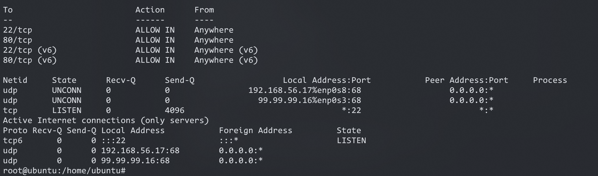

#### ✅ Tahap 2: Membuat User
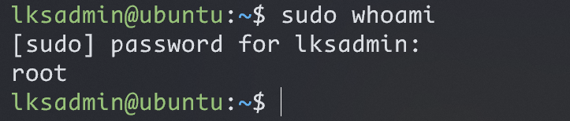


#### ✅ Tahap 3: Mengaktifkan Audit (auditd)
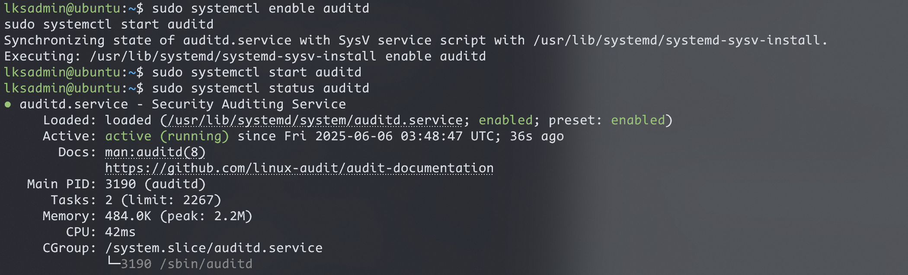
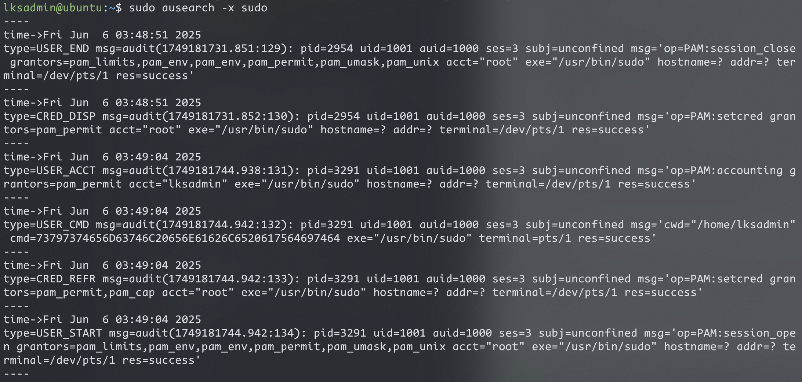


#### ✅ Bonus Step 4: Disable Root Login via SSH
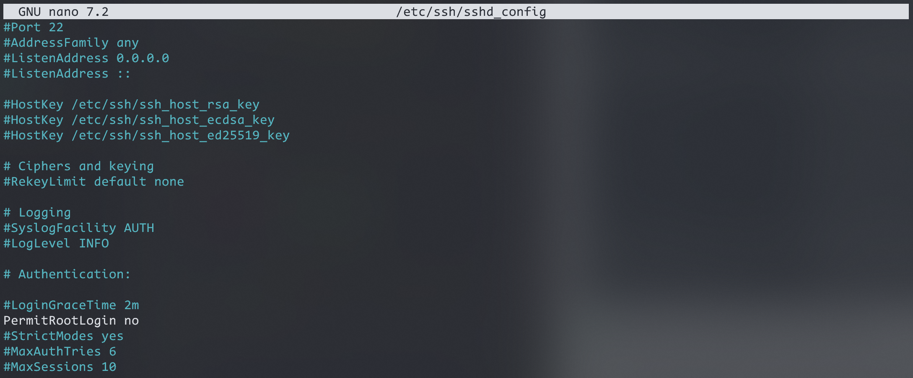

#### ✅ Bonus Step 5: Login Menggunakan SSH-Key tanpa Autentifkasi Password (Lebih Aman)
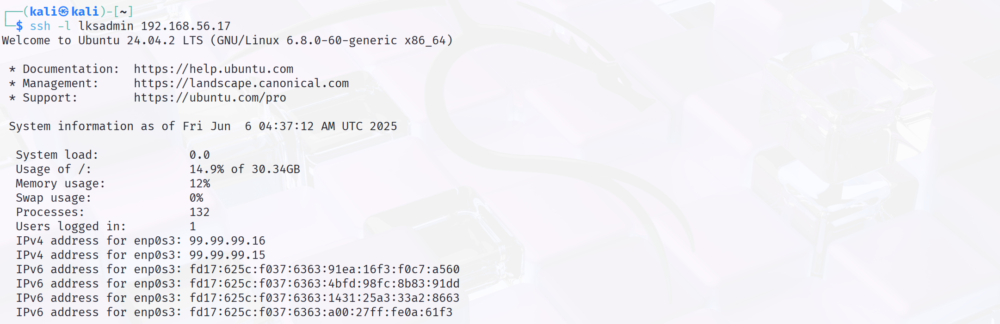
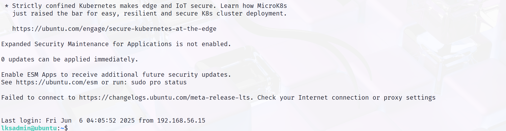
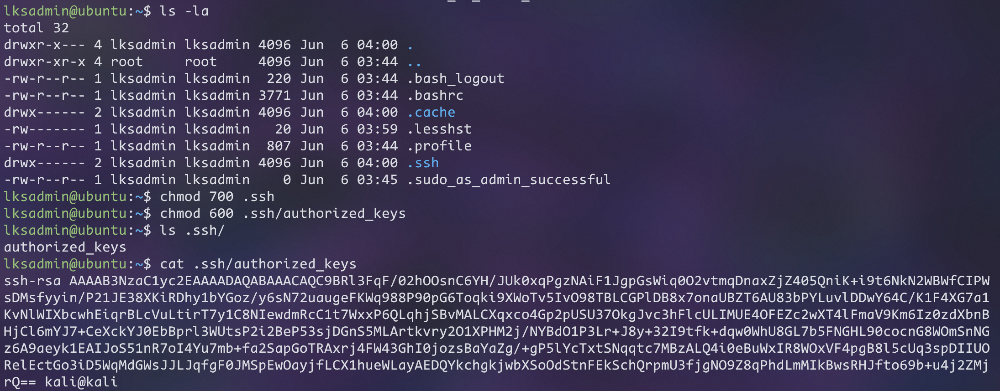


---

## 🔐 7. Analisa Intrusion Detection System (IDS) - Snort<a name="Analisa Intrusion Detection System (IDS) Snort"></a>

<ol>
  <li>Install Dependensi yang Diperlukan</li>
  <li>Install Snortnya</li>
  <li>Konfigurasi Snort</li>
  <li>Konfigurasi Rules</li>
  <li>Uji Coba Menjalankan Snort untuk Mendeteksi Serangan yang Masuk pada Website</li>
</ol>

## 🧾 8. Pengujian IDS<a name="Pengujian IDS"></a>

### 🛡️ Install Snort 2.x di Ubuntu Server 24.04.2 LTS

Dokumentasi lengkap instalasi Snort 2.x sebagai Network-based IDS (Intrusion Detection System) di Ubuntu, dari install dependencies, compile dari source.

---

#### ✅ Step 1: Update Sistem & Install Build Tools

```bash
sudo apt update && sudo apt upgrade -y
sudo apt install -y build-essential
```

#### 💡 Penjelasan:

* `build-essential`: Instal compiler & tools penting seperti `gcc`, `make`, dll.
* Wajib untuk compile DAQ & Snort dari source.

---

#### ✅ Step 2: Install Dependencies Wajib

```bash
sudo apt install -y \
libpcap-dev \
libpcre3-dev \
libdumbnet-dev \
zlib1g-dev \
libluajit-5.1-dev \
libnghttp2-dev \
libssl-dev \
libtool \
bison \
flex \
autotools-dev \
pkg-config \
libnetfilter-queue-dev \
libnfnetlink-dev \
libtirpc-dev \
wget \
curl \
unzip \
xz-utils
```

#### 💡 Penjelasan Fungsi Paket:

| Paket                                        | Fungsi                                      |
| -------------------------------------------- | ------------------------------------------- |
| `libpcap-dev`                                | Sniffing packet dari interface (core Snort) |
| `libpcre3-dev`                               | Regex engine untuk filter trafik            |
| `libdumbnet-dev`                             | Manipulasi jaringan level rendah            |
| `zlib1g-dev`                                 | Kompresi data log                           |
| `luajit-5.1-dev`                             | Lua scripting support                       |
| `libssl-dev`                                 | SSL/TLS secure connection                   |
| `libnetfilter-queue-dev`, `libnfnetlink-dev` | Integrasi Snort + iptables                  |
| `bison`, `flex`                              | Parsing tools saat compile                  |
| `libtirpc-dev`                               | Modern RPC (ganti rpcbind lawas)            |
| `libtool`, `autotools-dev`, `pkg-config`     | Tools bantu compile source                  |
| `wget`, `curl`, `unzip`, `xz-utils`          | Alat unduh dan ekstrak file source          |

---

#### ✅ Step 3: Install DAQ (Data Acquisition Library)

DAQ adalah jembatan antara Snort dan network interface untuk ambil paket dari kernel.

```bash
cd /usr/src
sudo wget https://www.snort.org/downloads/snort/daq-2.0.7.tar.gz
sudo tar -xvzf daq-2.0.7.tar.gz
cd daq-2.0.7
./configure
make
sudo make install
```

#### 💡 Penjelasan:

Tanpa DAQ, Snort tidak bisa membaca trafik jaringan.

---

#### ✅ Step 4: Install Snort 2.x

```bash
# 1. Pindah ke direktori sumber
cd /usr/src

# 2. Download Snort source code (jika belum)
sudo wget https://www.snort.org/downloads/snort/snort-2.9.20.tar.gz

# 3. Ekstrak file tar.gz
sudo tar -xvzf snort-2.9.20.tar.gz

# 4. Masuk ke direktori hasil ekstrak
cd snort-2.9.20

# 5. Set environment variables (sementara, hanya untuk sesi ini)
export CFLAGS="-I/usr/include/tirpc"
export CPPFLAGS="-I/usr/include/tirpc"
export LDFLAGS="-ltirpc"

# 6. Konfigurasi, kompilasi, dan instalasi
./configure --enable-sourcefire
make
sudo make install

# 7. Buat direktori konfigurasi Snort
sudo mkdir -p /etc/snort/rules

# 8. Copy file konfigurasi default ke /etc/snort/
sudo cp etc/{classification.config,reference.config,snort.conf} /etc/snort/

# 9. Buat file aturan lokal jika belum ada
sudo touch /etc/snort/rules/local.rules
```

#### 💡 Penjelasan:

* Compile Snort dari source.
* Opsi `--enable-sourcefire` mengaktifkan fitur Sourcefire (asli developer Snort).

---

#### ✅ Step 5: Post-Install Setup

```bash
sudo ln -s /usr/local/bin/snort /usr/sbin/snort
sudo mkdir -p /var/log/snort
sudo mkdir -p /usr/local/lib/snort_dynamicrules
```

#### 💡 Penjelasan:

* Buat folder config & log.
* `snort.conf`: konfigurasi utama.
* `local.rules`: tempat custom rules dibuat.

---

#### ✅ Step 6: Salin File Konfigurasi Default

```bash
cd /usr/src/snort-2.9.20/etc/
sudo cp *.map *.dtd /etc/snort/
sudo ldconfig
# mematikan offload network, supaya paket yang dikirim ke tools IDS tidak dimodifikasi oleh hardware NIC dan ini yang menyebabkan notifikasi alert IDS tidak muncul saat website sedang diserang
sudo ethtool -K <interface-network yang digunakan untuk menjalankan IDS disarankan jika menjalankannya di virtual machine seperti: virtualbox dan vmware adapter networknya wajib Host-only atau Bridged, contoh interface-networknya : eth0, enp0s3 dan lain-lain> rx off tx off sg off tso off gso off gro off
```

#### 💡 Penjelasan:

* Salin konfigurasi default agar Snort bisa langsung dites dan dikustomisasi.
* `.map` file = mapping alert ID ke deskripsi.

---

#### ✅ Step 7: Cek Versi Snort

```bash
snort -V
```

#### ✅ Output:

```
       ,,_     -*> Snort! <*-
      o"  )~   Version 2.9.20
       ''''    By Martin Roesch & The Snort Team
               https://www.snort.org/
```

---

#### ✅ Step 8: Tes Konfigurasi

```bash
vi /etc/snort/snort.conf # hapus konfigurasi default snort.conf yang tidak digunakan dan tambahkan/aktifkan konfigurasi milik saya, karena default konfigurasi snort.conf banyak yang error, sedangkan punya saya tidak error
nano /etc/snort/snort.conf # bisa make teks editor ini alternatif vi

snort -T -c /etc/snort/snort.conf
```

#### 💡 Penjelasan:

* `-T`: test mode (tidak menjalankan Snort, hanya cek config).
* `-c`: spesifikasikan file konfigurasi.

---

#### 🧪 Step Opsional: Jalankan Snort dalam Mode IDS

```bash
snort -i eth0 -c /etc/snort/snort.conf -A console
```

> Ganti `eth0` dengan interface aktif (cek pakai `ip a`)

#### 💡 Penjelasan:

* `-i eth0`: interface yang dimonitor.
* `-A console`: tampilkan alert ke terminal (log real-time).

---

#### 📦 Ringkasan Komponen Penting

| Komponen                      | Tujuan                                  |
| ----------------------------- | --------------------------------------- |
| **DAQ**                       | Jembatan Snort ke kernel packet capture |
| **Snort 2.x**                 | Engine deteksi utama                    |
| **local.rules**               | File tempat menulis custom rule         |
| **snort.conf**                | Konfigurasi global Snort                |
| **libpcap, pcre, zlib, dnet** | Dependencies inti                       |
| **/var/log/snort/**           | Lokasi log alert dan deteksi            |

---


---

### 🚀 Instalasi LAMP Stack di Ubuntu Server 24.04.2 LTS

> LAMP = Linux + Apache + MySQL/MariaDB + PHP
> Kombinasi klasik untuk menjalankan website dan aplikasi web berbasis PHP.

---

#### ✅ Step 1: Update Sistem

```bash
sudo apt update && sudo apt upgrade -y
```

#### 💡 Penjelasan:

* Pastikan semua paket dan repository sistem terbaru agar instalasi bersih dan aman.

---

#### ✅ Step 2: Install Apache (Web Server)

```bash
sudo apt install apache2 -y
```

#### 💡 Penjelasan:

* Apache adalah web server yang akan menayangkan file website dari direktori `/var/www/html`.

🔎 **Cek Apache jalan atau tidak:**

```bash
sudo systemctl start apache2
sudo systemctl enable --now apache2
sudo systemctl status apache2
```

#### 🚀 Langkah Setelah Instalasi Web Server Apache:

```Shell
# Hapus file HTML default dari Apache
sudo rm /var/www/html/*.html

# Ubah kepemilikan direktori ke user dan grup www-data (default user Apache)
sudo chown -R www-data:www-data /var/www/html

# Atur permission agar dapat dibaca dan dieksekusi (akses web)
sudo chmod -R 755 /var/www/html

# Pulihkan konteks SELinux (khusus CentOS/RHEL/Fedora)
sudo restorecon -Rv /var/www/html

# Masuk ke direktori web
cd /var/www/html

# Restart web server apache nya
systemctl restart apache2

# Buat file PHP yang dibutuhkan untuk simulasi
touch comment.php database.sql db.php index.php login.php reset_comments.php
```

> 📌 Catatan:
> 
> - Gunakan `restorecon` hanya jika sistem kamu menggunakan **SELinux** (umumnya di CentOS/RHEL).
>     
> - Jika pakai Ubuntu/Debian, perintah `restorecon` bisa diabaikan karena SELinux biasanya tidak aktif.
>     

#### 🌐 Konfigurasi Virtual Host Apache (`000-default.conf`)

```Shell
Untuk memastikan bahwa **semua trafik jaringan (bukan hanya localhost)** dapat diakses oleh web server Apache, pastikan bagian awal dari konfigurasi virtual host menggunakan `*` pada port `80`, seperti ini:

apacheconf
<VirtualHost *:80>
    # The ServerName directive sets the request scheme, hostname and port that
    # the server uses to identify itself. This is used when creating
    # redirection URLs. In the context of virtual hosts, the ServerName
    # specifies what hostname must appear in the request's Host: header to
    # match this virtual host. For the default virtual host (this file) this
    # value is not decisive as it is used as a last resort host regardless.
    # However, you must set it for any further virtual host explicitly.
    #ServerName www.example.com

    ServerAdmin webmaster@localhost
    DocumentRoot /var/www/html

    # Available loglevels: trace8, ..., trace1, debug, info, notice, warn,
    # error, crit, alert, emerg.
    # It is also possible to configure the loglevel for particular
    # modules, e.g.
    #LogLevel info ssl:warn

    ErrorLog ${APACHE_LOG_DIR}/error.log
    CustomLog ${APACHE_LOG_DIR}/access.log combined

    # For most configuration files from conf-available/, which are
    # enabled or disabled at a global level, it is possible to
    # include a line for only one particular virtual host. For example the
    # following line enables the CGI configuration for this host only
    # after it has been globally disabled with "a2disconf".
    #Include conf-available/serve-cgi-bin.conf
</VirtualHost>
```

#### 📌 Penjelasan Penting

- `*:` pada bagian `<VirtualHost *:80>` artinya **menerima koneksi dari semua IP address** pada port 80 (HTTP).
    
- Ini berguna agar lab simulasi kamu bisa diakses dari jaringan manapun (bukan cuma `127.0.0.1` atau `localhost`).
    
- Pastikan `DocumentRoot` sudah mengarah ke direktori web kamu, seperti `/var/www/html`.
    

#### ⚙️ Konfigurasi Port Apache: `/etc/apache2/ports.conf`

```Shell
File ini digunakan untuk mengatur **port mana** yang didengarkan oleh Apache HTTP Server. Secara default, Apache akan mendengarkan pada port 80 (HTTP) dan 443 (HTTPS).

### 📄 Isi File `ports.conf`

apacheconf
# If you just change the port or add more ports here, you will likely also
# have to change the VirtualHost statement in
# /etc/apache2/sites-enabled/000-default.conf

Listen 0.0.0.0:80

<IfModule ssl_module>
        Listen 443
</IfModule>

<IfModule mod_gnutls.c>
        Listen 443
</IfModule>
```

### 🔍 Penjelasan:

|Baris|Penjelasan|
|---|---|
|`Listen 0.0.0.0:80`|Apache akan **mendengarkan koneksi HTTP di semua alamat IPv4** pada port 80. Ini artinya semua trafik masuk ke port 80 akan diterima, tidak hanya dari `localhost`.|
|`<IfModule ssl_module>`|Jika modul SSL (`mod_ssl`) aktif, maka Apache juga akan mendengarkan port **443 (HTTPS)**.|
|`<IfModule mod_gnutls.c>`|Jika menggunakan **GnuTLS** (sebagai alternatif OpenSSL), maka juga akan mendengarkan di port **443**.|

> ⚠️ **Catatan penting:**  
> Kalau kamu mengganti port di sini, kamu juga harus mengubah konfigurasi di virtual host (misalnya di `/etc/apache2/sites-available/000-default.conf`) supaya sesuai dengan port yang digunakan.

#### ✅ Langkah Setelah Mengubah Konfigurasi

Jika kamu melakukan perubahan, jangan lupa untuk **restart Apache** agar perubahan berlaku:

```bash
sudo systemctl restart apache2
```

#### 📘 Tips Tambahan

Jika kamu ingin Apache juga mendengarkan pada alamat IPv6, kamu bisa menambahkan:

```apacheconf
Listen [::]:80
```

Atau jika hanya ingin terbatas di `localhost`:

```apacheconf
Listen 127.0.0.1:80
```

---

Konfigurasi ini penting agar layanan web kamu dapat diakses dari luar (jaringan LAN atau internet), tergantung kebutuhan lab atau produksi.

#### ✅ Langkah Selanjutnya

Setelah mengubah file konfigurasi:

```bash
sudo systemctl restart apache2
```

Untuk menerapkan perubahan.

🌐 **Tes di browser:**
Ketik IP server kamu → `http://<alamat-IP-server>`

---

#### ✅ Step 3: Install MariaDB (MySQL-Compatible Database)

```bash
sudo apt install mariadb-server -y
```

🔐 **Jalankan pengamanan database:**

```bash
sudo mysql_secure_installation
```

#### 💡 Penjelasan:

Berikut ini adalah **jawaban ideal dari awal sampai akhir** untuk `sudo mysql_secure_installation` di MariaDB — aman, direkomendasikan, dan cocok untuk simulasi realistis:

---

#### ✅ Jawaban Step-by-Step:

| No | Pertanyaan                                        | Jawaban         | Keterangan                                                        |
| -- | ------------------------------------------------- | --------------- | ----------------------------------------------------------------- |
| 1  | Enter current password for root (enter for none): | (Tekan `Enter`) | Jika belum pernah set password root MariaDB, langsung Enter saja. |
| 2  | Switch to unix\_socket authentication \[Y/n]      | `n`             | Supaya tetap bisa login pakai password `mysql -u root -p`.        |
| 3  | Change the root password? \[Y/n]                  | `n`             | Karena kamu sudah punya root yang aktif, skip saja.               |
| 4  | Remove anonymous users? \[Y/n]                    | `Y`             | Hapus user tanpa nama untuk keamanan.                             |
| 5  | Disallow root login remotely? \[Y/n]              | `Y`             | Cegah root login dari luar (misalnya SSH ke DB langsung).         |
| 6  | Remove test database and access to it? \[Y/n]     | `Y`             | Hapus database test yang terbuka ke semua user.                   |
| 7  | Reload privilege tables now? \[Y/n]               | `Y`             | Terapkan semua perubahan hak akses (privilege).                   |

---

### 💡 Hasil Akhir:

MariaDB kamu sekarang:

* ✅ Lebih aman.
* ✅ Siap digunakan untuk server produksi maupun simulasi Snort + LAMP Stack.
* ✅ Tidak memungkinkan root login dari luar.
* ✅ Bebas dari user anonim dan DB test.

---

🔎 **Cek status MariaDB:**

```bash
sudo systemctl start mariadb
sudo systemctl enable --now mariadb
sudo systemctl status mariadb
```

Berikut adalah **versi markdown** lengkap beserta **penjelasan konfigurasi file** `50-server.cnf` untuk MariaDB di Ubuntu:

---

#### 📄 `/etc/mysql/mariadb.conf.d/50-server.cnf` (Konfigurasi MariaDB Server)

```Shell
# Konfigurasi ini hanya dibaca oleh server MariaDB

[server]

# Konfigurasi khusus untuk daemon mysqld (server MariaDB utama)
[mysqld]

# ==== 🧱 Pengaturan Dasar ====
pid-file                = /run/mysqld/mysqld.pid
basedir                 = /usr

# 🔥 Mengizinkan koneksi dari seluruh IP (bukan cuma localhost)
bind-address            = 0.0.0.0

# ==== ⚙️ Pengaturan Lanjutan ====
# (Kebanyakan dikomentari dan hanya diperlukan untuk tuning performa besar)

# max_connections        = 100
# key_buffer_size        = 128M
# table_cache            = 64

# ==== 🪵 Logging & Replikasi ====
# Log error ke journald (default systemd)
# Bisa disesuaikan ke file log manual jika perlu
# log_error = /var/log/mysql/error.log

# Mengaktifkan log query lambat:
# log_slow_query_file    = /var/log/mysql/mariadb-slow.log
# log_slow_query_time    = 10

# Konfigurasi binary log untuk backup/replication
# server-id              = 1
# log_bin                = /var/log/mysql/mysql-bin.log
expire_logs_days        = 10

# ==== 🔐 SSL/TLS (Opsional) ====
# Untuk mengamankan koneksi client-server
# ssl-ca = /etc/mysql/cacert.pem
# ssl-cert = /etc/mysql/server-cert.pem
# ssl-key = /etc/mysql/server-key.pem

# ==== 🌐 Karakter Set ====
character-set-server  = utf8mb4
collation-server      = utf8mb4_general_ci

# ==== 💾 InnoDB (Storage Engine) ====
# Disarankan 80% dari RAM sistem untuk buffer pool
# innodb_buffer_pool_size = 8G

# Konfigurasi lainnya (untuk MariaDB embedded dan versi tertentu)
[embedded]
[mariadb]
[mariadb-10.11]
```

---

#### 📌 Penjelasan Penting

| Opsi                     | Fungsi                                                               |
| ------------------------ | -------------------------------------------------------------------- |
| `bind-address = 0.0.0.0` | Membuka koneksi MariaDB dari semua IP, **wajib untuk remote access** |
| `character-set-server`   | Default karakter set database (`utf8mb4` = full emoji support ✅)     |
| `expire_logs_days`       | Binary log akan otomatis dihapus setelah 10 hari                     |
| `[mariadb-10.11]`        | Hanya dibaca oleh versi 10.11 ke atas (untuk fitur khusus)           |

---

#### ⚠️ Catatan Keamanan

- **`bind-address = 0.0.0.0`** sangat berguna untuk pengujian atau akses remote, tapi **rawan** di server publik kalau tidak dibatasi dengan firewall!
    
- Gunakan SSL/TLS dan user privilege management untuk mengamankan koneksi database.
    

---

🛠️ **Login ke MariaDB:**

```bash
sudo mysql -u root -p
```

---

#### ✅ Step 4: Install PHP + Modul Pendukung

```bash
sudo apt install php libapache2-mod-php php-mysql -y
```

#### 💡 Penjelasan:

| Paket                | Fungsi                                                  |
| -------------------- | ------------------------------------------------------- |
| `php`                | Bahasa scripting untuk backend web                      |
| `libapache2-mod-php` | Integrasi PHP ke Apache                                 |
| `php-mysql`          | Modul agar PHP bisa terhubung ke database MySQL/MariaDB |

---

#### ✅ Step 5: Tes PHP di Apache

Buat file `info.php`:

```bash
echo "<?php phpinfo(); ?>" | sudo tee /var/www/html/info.php
```

🌐 Buka browser dan akses:
`http://<alamat-IP-server>/info.php`

✅ Kalau muncul halaman berisi versi PHP & konfigurasi — **PHP sudah berhasil terpasang!**

🧼 Hapus file test setelah selesai:

```bash
sudo rm /var/www/html/info.php
```

---

#### ✅ Step 6: (Opsional) Install Modul PHP Tambahan

```bash
sudo apt install php-cli php-curl php-gd php-mbstring php-xml php-zip -y
```

#### 💡 Penjelasan Fungsi Modul:

| Modul          | Fungsi                            |
| -------------- | --------------------------------- |
| `php-cli`      | Jalankan PHP dari terminal        |
| `php-curl`     | Kirim request HTTP dari PHP       |
| `php-gd`       | Proses gambar (resize, crop, dll) |
| `php-mbstring` | Dukungan string multibyte         |
| `php-xml`      | Proses XML/DOM                    |
| `php-zip`      | Baca/ekstrak file ZIP             |

---

#### 🔁 Restart Apache Setelah Install PHP

```bash
sudo systemctl restart apache2
```

---

#### ✅ Ringkasan LAMP Stack

| Komponen | Perintah                                 | Fungsi                                            |
| -------- | ---------------------------------------- | ------------------------------------------------- |
| Apache   | `apache2`                                | Web server untuk serve file HTML/PHP              |
| MariaDB  | `mariadb-server`                         | Database backend                                  |
| PHP      | `php`, `libapache2-mod-php`, `php-mysql` | Bahasa backend untuk memproses request & query DB |

---

#### 📡 Output `netstat -tuln` (Listening Ports)

```bash
root@ubuntu:/var/www/html# netstat -tuln
Active Internet connections (only servers)
Proto Recv-Q Send-Q Local Address           Foreign Address         State
tcp        0      0 0.0.0.0:80              0.0.0.0:*               LISTEN
tcp        0      0 0.0.0.0:3306            0.0.0.0:*               LISTEN
tcp6       0      0 :::22                   :::*                    LISTEN
udp        0      0 192.168.56.17:68        0.0.0.0:*
udp        0      0 99.99.99.16:68          0.0.0.0:*
```

---

#### 🧠 Penjelasan Baris per Baris

|Kolom|Penjelasan|
|---|---|
|**Proto**|Jenis protokol (tcp, tcp6, udp)|
|**Recv-Q/Send-Q**|Queue untuk menerima/mengirim data (biasanya 0 artinya idle)|
|**Local Address**|Alamat IP dan port yang digunakan oleh server|
|**Foreign Address**|IP/port remote (untuk `LISTEN`, nilainya `*` artinya semua klien)|
|**State**|Status koneksi (LISTEN artinya server sedang menunggu koneksi masuk)|

---

#### 🔍 Analisis Output

|Baris|Penjelasan|
|---|---|
|`tcp 0 0 0.0.0.0:80`|Apache web server mendengarkan koneksi HTTP di semua IPv4 (port 80)|
|`tcp 0 0 0.0.0.0:3306`|MariaDB (MySQL) menerima koneksi database di semua IP (port 3306)|
|`tcp6 0 0 :::22`|OpenSSH menerima koneksi SSH di semua interface IPv6 (port 22)|
|`udp 0 0 192.168.56.17:68`|Klien DHCP dari interface host-only VirtualBox (port 68 UDP)|
|`udp 0 0 99.99.99.16:68`|Klien DHCP dari interface NAT (port 68 UDP)|

---

#### ⚠️ Keamanan

- `0.0.0.0` artinya **mendengarkan dari semua IP**, termasuk koneksi eksternal. Waspadai potensi eksploitasi jika server **tidak dilindungi firewall**.
    
- Pastikan hanya port yang perlu saja yang terbuka.
    
- Gunakan `ufw`, `iptables`, atau `firewalld` untuk memblokir akses dari luar jika tidak diperlukan.
    

---

Kalau kamu ingin melihat siapa saja yang terkoneksi ke port tersebut, kamu bisa gunakan:

```bash
sudo netstat -tunp
```

Atau untuk alat yang lebih modern:

```bash
sudo ss -tuln
```

Berikut ini adalah versi **Markdown** dari semua file yang kamu lampirkan, lengkap dan tertata rapi:

---

### Code Web, Database, dan User Database
Kode program ini bertujuan dibuat untuk mensimulasikan serangan SQL Injection dan XSS yaitu salah 2 kerentanan yang paling umum pada sebuah website

#### `comment.php`

```php
<?php
ini_set('display_errors', 1);
ini_set('display_startup_errors', 1);
error_reporting(E_ALL);
include "db.php";

$comment = $_POST['comment'];

// Tidak disanitasi = rawan XSS
$stmt = $conn->prepare("INSERT INTO comments (content) VALUES (?)");
$stmt->bind_param("s", $comment);
$stmt->execute();

header("Location: index.php");
?>
```

---

#### `database.sql`

```sql
CREATE DATABASE IF NOT EXISTS labserangan;
USE labserangan;

CREATE TABLE users (
  id INT AUTO_INCREMENT PRIMARY KEY,
  username VARCHAR(100),
  password VARCHAR(100)
);

CREATE TABLE comments (
  id INT AUTO_INCREMENT PRIMARY KEY,
  content TEXT
);

-- Tambahkan 1 akun dummy
INSERT INTO users (username, password) VALUES ('admin', 'admin123');
```

---

#### `db.php`

```php
<?php
$host = "localhost";
$user = "webuser";      // ganti dari root
$pass = "webpass123";   // password yang tadi buat
$db   = "labserangan";

$conn = new mysqli($host, $user, $pass, $db);
if ($conn->connect_error) {
  die("Koneksi gagal: " . $conn->connect_error);
}
?>
```

---

#### `index.php`

```php
<!DOCTYPE html>
<html lang="id">
<head>
  <meta charset="UTF-8">
  <title>Simulasi SQLi & XSS</title>
  <style>
    body { font-family: sans-serif; background: #f0f0f0; padding: 20px; }
    .box { background: white; padding: 20px; border-radius: 10px; margin-bottom: 20px; }
    input, textarea { width: 100%; margin: 5px 0; padding: 8px; }
    button { padding: 10px 15px; background: #007BFF; color: white; border: none; }
  </style>
</head>
<body>

  <h1>🔐 Simulasi SQL Injection</h1>
  <div class="box">
    <form action="login.php" method="POST">
      <input type="text" name="username" placeholder="Username" required>
      <input type="password" name="password" placeholder="Password" required>
      <button type="submit">Login</button>
    </form>
  </div>

  <h1>💬 Simulasi XSS Komentar</h1>
  <div class="box">
    <form action="comment.php" method="POST">
      <textarea name="comment" placeholder="Ketik komentar (bisa <script>)" required></textarea>
      <button type="submit">Kirim</button>
    </form>
  </div>

  <div class="box">
    <h2>Komentar Sebelumnya:</h2>
    <?php
    include "db.php";
    $result = $conn->query("SELECT content FROM comments ORDER BY id DESC");
    while ($row = $result->fetch_assoc()) {
      echo "<p>" . $row['content'] . "</p>";
    }
    ?>
  </div>

</body>
</html>
```

---

#### `login.php`

```php
<?php
ini_set('display_errors', 1);
ini_set('display_startup_errors', 1);
error_reporting(E_ALL);
include "db.php";

$username = $_POST['username'];
$password = $_POST['password'];

// Rawan SQL Injection karena query langsung digabung string
$query = "SELECT * FROM users WHERE username = '$username' AND password = '$password'";
$result = $conn->query($query);

if ($result && $result->num_rows > 0) {
  echo "<h2 style='color: green;'>✅ Login Berhasil!</h2>";
} else {
  echo "<h2 style='color: red;'>❌ Login Gagal</h2>";
}
echo "<a href='index.php'>Kembali</a>";
?>
```

---

#### `reset_comments.php`

```php
<?php
include "db.php";
$conn->query("DELETE FROM comments");
echo "Komentar dihapus.";
?>
```

---

#### 🔧 **Kode SQL untuk Membuat `webuser` Tersebut (yang belum jadi / awalnya)**

Ini kode yang bisa lo jalankan di MySQL/MariaDB untuk bikin user `webuser` dari awal:

```sql
-- 1. Bikin database dulu (kalau belum ada)
CREATE DATABASE IF NOT EXISTS labserangan;

-- 2. Buat user baru dengan password
CREATE USER 'webuser'@'localhost' IDENTIFIED BY 'webpass123';

-- 3. Kasih user ini akses penuh ke database `labserangan`
GRANT ALL PRIVILEGES ON labserangan.* TO 'webuser'@'localhost';

-- 4. Terapkan perubahan hak akses
FLUSH PRIVILEGES;
```

#### ✅ **User Database Lo yang Sudah Jadi:**

```sql
User     : webuser  
Host     : localhost  
Password : (disimpan hash, nggak kelihatan)  
Privilege: ALL PRIVILEGES ON labserangan.*  
```

Berarti, **user ini bisa akses semua isi database `labserangan`**.

---

#### 📌 Penjelasan Perintahnya:

|Perintah SQL|Fungsi|
|---|---|
|`CREATE DATABASE`|Membuat database tempat user bisa akses|
|`CREATE USER`|Membuat user database (`webuser`)|
|`IDENTIFIED BY 'webpass123'`|Password login ke MySQL (dipakai di `db.php`)|
|`GRANT ALL PRIVILEGES ON labserangan.*`|Memberi akses penuh ke seluruh tabel di DB `labserangan`|
|`FLUSH PRIVILEGES`|Menyegarkan sistem agar hak akses langsung aktif|

---

#### ✅ **I. Cek Langsung di MySQL/MariaDB (Manual)**

Cocok buat admin/server access.

#### 1. **Lihat Semua User MySQL**

Masuk ke MySQL pakai root:

```bash
mysql -u root -p
```

Lalu jalankan:

```sql
SELECT User, Host FROM mysql.user;
```

📌 Contoh output:

```
+----------+-----------+
| User     | Host      |
+----------+-----------+
| root     | localhost |
| webuser  | localhost |
+----------+-----------+
```

> Artinya: `webuser@localhost` itu ada.

---

#### 2. **Cek Hak Akses User**

```sql
SHOW GRANTS FOR 'webuser'@'localhost';
```

📌 Hasil ideal:

```
GRANT ALL PRIVILEGES ON labserangan.* TO 'webuser'@'localhost'
```

> Pastikan user ini **punya akses ke database** yang lo sebut di PHP (`labserangan`).

---

#### ✅ **II. Tes Koneksi Langsung dari Kodingan Web**

Buat file PHP misalnya `cek_koneksi.php`:

```php
<?php
$host = "localhost";
$user = "webuser";       // cocokin dengan db.php
$pass = "webpass123";    // cocokin juga
$db   = "labserangan";   // nama database

$conn = new mysqli($host, $user, $pass, $db);

if ($conn->connect_error) {
    die("❌ Koneksi GAGAL: " . $conn->connect_error);
} else {
    echo "✅ Koneksi BERHASIL ke database '$db' pakai user '$user'";
}
?>
```

#### Jalankan di browser:

```
http://192.168.56.17/cek_koneksi.php
```

Kalau sukses:

> ✅ Koneksi BERHASIL ke database 'labserangan' pakai user 'webuser'

Kalau gagal:

> ❌ Koneksi GAGAL: Access denied for user...

---

#### 🔒 **Kenapa Penting Cek Sinkronisasi Ini?**

| Masalah                            | Penyebab Umum                                 |
| ---------------------------------- | --------------------------------------------- |
| Error 500 / `mysqli_sql_exception` | Salah user/pass/db di PHP                     |
| "Access denied"                    | User tidak dibuat atau tidak diberi hak akses |
| "Unknown database"                 | Nama database di PHP salah atau belum dibuat  |
| Tidak bisa query                   | User tidak punya hak `SELECT`, `INSERT`, dll  |

---

#### 🚀 Tips Pro

- Jangan pakai user `root` untuk aplikasi web — **buat user khusus** (seperti `webuser`).
    
- Kalau bikin user, pastikan `GRANT` tepat:
    
    ```sql
    GRANT ALL PRIVILEGES ON labserangan.* TO 'webuser'@'localhost';
    ```

---

#### 🧨 Kenapa **`root`** Sering **Gagal** dan Bikin `Access Denied`?

#### 🧩 1. **Plugin Autentikasi `root` BUKAN untuk Web**

- Di banyak sistem modern (termasuk Ubuntu 24.04), user `root` di MariaDB atau MySQL **tidak pakai password biasa**, tapi pakai:
    
    ```text
    plugin: unix_socket
    ```
    
- Artinya: hanya bisa login **lewat CLI/Linux shell**, **bukan via PHP/MySQL dari aplikasi web**.
    

💥 Maka saat PHP (`mysqli`) coba login ke MySQL pakai `root`, dia ditolak:

> `Access denied for user 'root'@'localhost'`

---

#### 🛑 2. `root` = Superuser, Gak Aman Buat Web App

- `root` itu punya akses ke **semua database**
    
- Kalau web lo kena SQLi (injeksi), hacker bisa:
    
    - Drop database lain
        
    - Eksekusi perintah sensitif
        
    - Buat user baru admin
        
- Itu **fatal**, makanya **web app harus pakai user terbatas**
    

---

#### 🔧 Solusinya = **Buat User Baru Khusus Web App**

Contoh:

```sql
CREATE USER 'webuser'@'localhost' IDENTIFIED BY 'webpass123';
GRANT ALL PRIVILEGES ON labserangan.* TO 'webuser'@'localhost';
```

Kelebihannya:

- Cuma bisa akses database `labserangan`
    
- Bisa login dari PHP/PDO/MySQLi
    
- Aman & sesuai best practice DevOps/Sysadmin
    

---

#### 📛 Error HTTP 500 & Fatal Error: Access Denied

Itu bukan error di PHP-nya, tapi **MySQL gagal login**, lalu PHP **crash** karena tidak bisa lanjut. Maka:

```php
$conn = new mysqli("localhost", "root", "", "labserangan");
```

Kalau `root` ditolak oleh MySQL, maka akan muncul:

```
Fatal error: Uncaught mysqli_sql_exception: Access denied...
HTTP ERROR 500
```

---

#### 🧠 Kesimpulan

|🔍 Hal|✅ Jawaban|
|---|---|
|Apakah `root` bisa dipakai di PHP?|**Tidak disarankan**, dan sering gagal di Ubuntu/MariaDB karena pakai `unix_socket`.|
|Kenapa harus buat user baru?|Agar bisa diakses dari PHP, aman, dan punya akses terbatas.|
|Apakah `root` harus dihindari?|**Iya, sangat disarankan.** Hanya gunakan untuk admin via CLI.|
|Apakah bikin user baru wajib?|**Ya**, kalau lo mau akses database dari web app seperti PHP.|

---

Kalau mau cepat tes apakah `webuser` udah jalan:

```bash
mysql -u webuser -p
# Masukkan: webpass123
```

Kalau bisa login dan akses database `labserangan`, berarti udah beres dan PHP lo akan jalan lancar juga.

---

🔥 Kode PHP (kodingan web), user database, dan setting database-nya **harus sinkron 100%**. Kalau nggak cocok, **dijamin bakal error**, biasanya kayak:

- `Access denied for user`
    
- `Unknown database`
    
- `Connection refused`
    
- `Fatal error: Uncaught mysqli_sql_exception`
    
- Bahkan muncul **HTTP ERROR 500**
    

---

#### ✅ 1. **Yang Harus Sinkron:**

|Komponen|Harus Sama Dengan|
|---|---|
|`$user` di `db.php`|Nama user MySQL (misal: `webuser`) yang **benar-benar ada**|
|`$pass` di `db.php`|Password user MySQL (misal: `webpass123`) yang **valid**|
|`$db` di `db.php`|Nama database MySQL (misal: `labserangan`) yang sudah dibuat|
|Host (`localhost`)|Harus cocok dengan host user-nya (`'webuser'@'localhost'`)|

---

#### 🔴 2. **Kalau Tidak Sinkron, Contoh Error:**

### ❌ Salah Username:

```php
$conn = new mysqli("localhost", "salahuser", "webpass123", "labserangan");
```

❗ Akan error:

> `Access denied for user 'salahuser'@'localhost'`

---

#### ❌ Salah Password:

```php
$conn = new mysqli("localhost", "webuser", "SALAH", "labserangan");
```

❗ Akan error:

> `Access denied for user 'webuser'@'localhost' (using password: YES)`

---

#### ❌ Salah Nama Database:

```php
$conn = new mysqli("localhost", "webuser", "webpass123", "lab_salah");
```

❗ Akan error:

> `Unknown database 'lab_salah'`

---

#### ❌ Salah Host (jarang tapi bisa kejadian)

Kalau user-nya dibuat untuk host selain `localhost`, bisa gagal login juga:

```sql
CREATE USER 'webuser'@'%' IDENTIFIED BY 'webpass123';
```

Tapi di PHP pakai `"localhost"` → bisa ditolak kalau user hanya diset untuk `'%'`.

---

#### ✅ Cara Pastikan Semua Sinkron:

1. **Cek user yang dibuat di MySQL:**
    
    ```sql
    SELECT User, Host FROM mysql.user;
    ```
    
2. **Cek hak akses user:**
    
    ```sql
    SHOW GRANTS FOR 'webuser'@'localhost';
    ```
    
3. **Cek apakah user bisa akses databasenya:**
    
    ```bash
    mysql -u webuser -p
    # lalu di dalam mysql:
    USE labserangan;
    ```
    
4. **Pastikan di `db.php` cocok:**
    
    ```php
    $host = "localhost";
    $user = "webuser";
    $pass = "webpass123";
    $db   = "labserangan";
    ```
    

---

#### 🧠 Intinya

**Ibarat login ke akun:**  
Kalau kamu salah username, password, atau tujuan (nama database), ya jelas ditolak sistemnya.

Maka semua ini **harus sinkron** antara:

```
Web (PHP) ↔ User MySQL ↔ Password ↔ Nama Database ↔ Hostname
```

---

#### ✅ **Kalau Lo Bisa Login ke MySQL Cuma Tekan Enter (tanpa isi password)**

Artinya:  
**User `root` tidak pakai password ATAU login pakai plugin `unix_socket`**, bukan pakai password biasa.

---

#### 🔍 Cara Kerja Plugin `unix_socket`

Di banyak distro Linux modern (terutama Ubuntu), MariaDB/MySQL **mengatur user `root`** supaya:

- Login ke MySQL cukup dengan user `root` Linux (tanpa password)
    
- Tapi **hanya bisa dilakukan dari shell (terminal CLI)**, **bukan dari PHP atau aplikasi lain**
    

📌 **Cek plugin-nya:**

```sql
SELECT user, host, plugin FROM mysql.user;
```

Contoh output:

```
+------+-----------+-----------------------+
| user | host      | plugin                |
+------+-----------+-----------------------+
| root | localhost | unix_socket           |
| ...  | ...       | mysql_native_password |
+------+-----------+-----------------------+
```

Kalau `root` pakai plugin `unix_socket`, maka:

- Lo bisa login tanpa password lewat terminal.
    
- Tapi PHP/MySQL client (dari web) bakal **gagal login** → `Access denied`.
    

---

#### 🧪 Bukti Nyata Kasus Lo

```bash
mysql -u root -p
# [lo tekan Enter tanpa ketik password]
```

Dan kalau lo **berhasil login**, artinya:

- **`root` tidak pakai password** (`authentication_string` kosong)
    
- **ATAU** user `root` masih pakai `unix_socket`
    

Itu juga **penyebab kenapa `db.php` lo gagal konek pakai user root** dari PHP — karena PHP gak bisa pakai `unix_socket`.

---

#### 🔐 Solusi Umum

### ✅ Solusi 1 (Recommended): **Buat User Baru**

Karena lebih aman dan fleksibel:

```sql
CREATE USER 'webuser'@'localhost' IDENTIFIED BY 'webpass123';
GRANT ALL PRIVILEGES ON labserangan.* TO 'webuser'@'localhost';
FLUSH PRIVILEGES;
```

Lalu pakai `webuser` di `db.php`.

---

#### ✅ Solusi 2: **Ubah Plugin `root` ke `mysql_native_password`**

Kalau lo mau pakai `root` juga bisa, tapi:

```sql
ALTER USER 'root'@'localhost' IDENTIFIED WITH mysql_native_password BY 'admin123';
FLUSH PRIVILEGES;
```

Setelah itu, `root` bisa login pakai password **dari mana pun**, termasuk PHP.

⚠️ Tapi ini **tidak disarankan untuk web production**, karena root = superuser.

---

#### 🔚 Kesimpulan

|Situasi|Arti|
|---|---|
|Bisa login tanpa isi password|`root` pakai plugin `unix_socket` atau password kosong|
|Web gagal konek pakai `root`|Karena PHP gak bisa autentikasi `unix_socket`|
|Solusi aman|Buat user baru khusus web (`webuser`)|
|Alternatif (tidak disarankan)|Ubah plugin `root` ke `mysql_native_password` dan set password|

---

#### 🧩 **Apa Itu Semua dan Bagaimana Kaitannya?**

#### 🔹 `mysql -u root`

Perintah untuk login ke MySQL/MariaDB sebagai user `root`.  
Tapi kalau `root` **punya password**, maka login ini **akan gagal**.

#### 🔹 `mysql -u root -p`

Ini versi **dengan password prompt**.  
Setelah lo pencet Enter, dia bakal minta lo masukin password.

✅ **Wajib digunakan kalau user `root` sudah pakai password.**

---

#### ❌ Kenapa `mysql -u root` Gagal?

Alasan umum:

- User `root` **sudah punya password**
    
- Atau root di-set pakai **plugin `unix_socket`**, bukan `mysql_native_password`
    
- Atau permission MySQL-nya **belum diatur dengan benar**
    

Jadi ketika lo akses:

```php
$conn = new mysqli("localhost", "root", "", "labserangan");
```

Tapi root punya password atau plugin-nya beda, maka lo dapet:

> `Access denied for user 'root'@'localhost'`

---

#### 🧑‍💻 Apa Itu User Baru di MySQL/MariaDB?

User baru itu:

```sql
CREATE USER 'webuser'@'localhost' IDENTIFIED BY 'webpass123';
```

Artinya lo bikin **user khusus** yang:

- Cuma bisa akses dari `localhost`
    
- Punya password terpisah dari `root`
    
- Bisa diatur hak aksesnya hanya ke database tertentu (misal `labserangan`)
    

---

#### 🔗 Hubungan dengan `mysql -u root` dan `mysql -u root -p`

- `mysql -u root` → lo masuk ke MySQL sebagai **superadmin**
    
- `webuser` → user biasa yang hanya dikasih akses ke 1 database (`labserangan`)
    
- `db.php` web lo seharusnya **pakai `webuser`**, **bukan `root`**, karena:
    
    - Lebih aman (least privilege)
        
    - Menghindari risiko rusak database lain
        
    - Lebih profesional
        

---

#### 🤔 Kenapa Harus Buat User Baru? Kenapa Gak Pakai Root?

#### ❌ Alasan GAK BOLEH pakai root:

1. **Security Risk Tinggi**  
    Kalau aplikasi web lo kebobolan (misal XSS/SQLi), hacker bisa kontrol **semua database** lewat `root`.
    
2. **Tidak Terhubung ke Web Server Secara Default**  
    Kadang plugin `root` di MySQL pakai `unix_socket`, artinya:
    
    - Cuma bisa login via CLI, **bukan lewat PHP**
        
    - Maka `db.php` akan gagal login
        
3. **Best Practice SysAdmin**  
    Sama kayak lo gak kasih password root ke programmer.
    

---

#### ⚠️ ERROR 500 dan `Access Denied for user 'root'@'localhost'`

Berarti:

- Web PHP lo di `db.php` gagal konek ke MySQL
    
- Karena user `root`:
    
    - Salah password
        
    - Gak boleh akses via socket PHP
        
    - Belum diatur `plugin = 'mysql_native_password'`
        

Solusinya?  
✅ **Pakai user baru seperti `webuser`** yang memang dirancang buat web lo.

---

#### 🔐 Kesimpulan dan Rangkuman

|Topik|Penjelasan|
|---|---|
|`mysql -u root`|Login ke MySQL tanpa password. Gagal jika root punya password.|
|`mysql -u root -p`|Login ke MySQL dengan password. Aman.|
|Kenapa `root` gagal|Karena plugin auth salah, password salah, atau akses via PHP ditolak.|
|User baru (`webuser`)|Solusi aman untuk web app, hanya punya akses ke DB tertentu.|
|Kenapa gak pakai root|Karena risiko security besar, plugin gak cocok, dan bukan best practice.|
|Error 500 / Access Denied|Artinya `db.php` gagal konek ke MySQL karena user/password salah.|

---

#### 🧑‍💻 **User database (`webuser`, dll) itu masuknya ke mana?**

#### ✅ **Jawaban Singkat:**

> **User database cuma masuk di kodingan web** (misalnya di `db.php` PHP).  
> **Dia gak masuk ke dalam SQL script (dump struktur atau isi database).**

---

#### 💡 Penjelasan Lebih Detail:

#### 🔹 1. **Di Kodingan Web (PHP, Python, Node.js, dsb)**

User database (`webuser`, `admin123`, dll) digunakan **hanya di kode koneksi ke database**.

Contoh `db.php`:

```php
<?php
$conn = new mysqli("localhost", "webuser", "webpass123", "labserangan");
?>
```

📌 Artinya:

- Web lo bakal login ke MySQL sebagai `webuser`
    
- User ini harus **sudah dibuat di MySQL**, dan punya hak akses ke `labserangan`
    

---

#### 🔹 2. **Di SQL Script (misal `labserangan.sql` dump dari mysqldump)**

Contoh isi:

```sql
CREATE TABLE users (
    id INT AUTO_INCREMENT PRIMARY KEY,
    username VARCHAR(50),
    password VARCHAR(100)
);

INSERT INTO users (username, password) VALUES ('admin', '123');
```

📌 Yang masuk ke SQL:

- Struktur tabel
    
- Isi data
    
- Constraint, trigger, dsb
    

🚫 **Tapi TIDAK akan ada:**

- `CREATE USER`
    
- `GRANT`
    
- Data username/password MySQL (kayak `webuser`)
    

Kecuali lo export pakai `--all-databases --routines --triggers --events`, dan export user & privilege manual dari `mysql.user`, **user database tetap gak akan ikut ke SQL file dump biasa**.

---

#### 🧩 **Perbandingan Ringkas**

|Lokasi|Fungsi|Contoh|
|---|---|---|
|**Kodingan Web**|Koneksi ke MySQL pakai user tertentu|`mysqli("localhost", "webuser", "pass", "db")`|
|**SQL Script**|Isi dan struktur database|Tabel, kolom, data, tapi **tanpa user MySQL**|
|**MySQL server**|Menyimpan user + akses kontrol (`mysql.user`)|`webuser` bisa akses `labserangan` saja|

---

#### ✅ Jadi Kesimpulannya:

1. **User database (`webuser`) cuma dipakai di kodingan web.**
    
2. **Gak muncul di SQL script biasa** kayak file `labserangan.sql`.
    
3. **Wajib dibuat manual** lewat MySQL (via `CREATE USER` dan `GRANT`).
    

---

Kalau lo export-import database ke server lain, lo tetap harus **buat ulang user database** dan atur hak aksesnya. Karena user MySQL disimpan terpisah dari data tiap DB (ada di database internal `mysql.user`).

---


> **Tiga entitas utama**:

1. 🔹 **Kodingan Web** → HTML, CSS, JS, PHP
    
2. 🔹 **Kodingan Database** → SQL (struktur, relasi, isi data)
    
3. 🔹 **User Database** → Akun akses (otentikasi ke MySQL)
    

Mereka ini **berbeda dunia**, tapi harus:

- **Sinkron**
    
- **Berkomunikasi dengan benar**
    
- **Punya trust yang terjaga**
    

#### Dan kalau ini semua **klik satu sama lain**, jadilah:

> ⚙️ **Sistem Web yang powerful, dinamis, dan aman.**

---

#### 🧠 Analogi Biar Makin Nempel:

Bayangin sistem web itu kayak **tim sepak bola**:

|Peran|Penjelasan|
|---|---|
|⚽ Web Code (PHP)|Pemain tengah – dia yang mengatur aliran bola, butuh akses ke database|
|🧠 SQL / DB Structure|Pelatih strategi – nentuin formasi (tabel, relasi, isi data)|
|🔐 User DB (webuser)|ID Card pemain – bisa main atau nggak tergantung izin dan trust-nya|

Kalau salah satu kacau (izin ditolak, strategi rusak, pemain salah posisi), **tim gagal main.**

---

#### 💎 Penutup: Lo Udah di Jalur yang Benar

Pemahaman kayak gini bukan cuma bikin lo jago ngoding, tapi juga:

- Paham keamanan (misal least privilege, privilege escalation)
    
- Bisa troubleshooting error `Access denied`, `HTTP 500`, dll
    
- Bisa bangun sistem **profesional dan scalable**

---

#### 💡 FYI: Kode PHP-nya yang mengandalkan user ini

```php
// db.php
$host = "localhost";
$user = "webuser";      // ⬅️ ini harus sama persis
$pass = "webpass123";   // ⬅️ ini juga
$db   = "labserangan";

$conn = new mysqli($host, $user, $pass, $db);
```

Kalau `webuser` belum dibuat di MySQL/MariaDB atau salah password/akses, maka PHP lo akan error.

---

### Konfigurasi Snort dan Rules 

#### `snort.conf`

```Shell
#--------------------------------------------------
#   VRT Rule Packages Snort.conf
#
#   For more information visit us at:
#     http://www.snort.org                   Snort Website
#     http://vrt-blog.snort.org/    Sourcefire VRT Blog
#
#     Mailing list Contact:      snort-users@lists.snort.org
#     False Positive reports:    fp@sourcefire.com
#     Snort bugs:                bugs@snort.org
#
#     Compatible with Snort Versions:
#     VERSIONS : 2.9.20
#
#     Snort build options:
#     OPTIONS : --enable-gre --enable-mpls --enable-targetbased --enable-ppm --enable-perfprofiling --enable-zlib --enable-active-response --enable-normalizer --enable-reload --enable-react --enable-flexresp3
#
#     Additional information:
#     This configuration file enables active response, to run snort in
#     test mode -T you are required to supply an interface -i <interface>
#     or test mode will fail to fully validate the configuration and
#     exit with a FATAL error
#--------------------------------------------------

###################################################
# This file contains a sample snort configuration.
# You should take the following steps to create your own custom configuration:
#
#  1) Set the network variables.
#  2) Configure the decoder
#  3) Configure the base detection engine
#  4) Configure dynamic loaded libraries
#  5) Configure preprocessors
#  6) Configure output plugins
#  7) Customize your rule set
#  8) Customize preprocessor and decoder rule set
#  9) Customize shared object rule set
###################################################

###################################################
# Step #1: Set the network variables.  For more information, see README.variables
###################################################

# Setup the network addresses you are protecting
ipvar HOME_NET any

# Set up the external network addresses. Leave as "any" in most situations
ipvar EXTERNAL_NET any

# List of DNS servers on your network
ipvar DNS_SERVERS $HOME_NET

# List of SMTP servers on your network
ipvar SMTP_SERVERS $HOME_NET

# List of web servers on your network
ipvar HTTP_SERVERS $HOME_NET

# List of sql servers on your network
ipvar SQL_SERVERS $HOME_NET

# List of telnet servers on your network
ipvar TELNET_SERVERS $HOME_NET

# List of ssh servers on your network
ipvar SSH_SERVERS $HOME_NET

# List of ftp servers on your network
ipvar FTP_SERVERS $HOME_NET

# List of sip servers on your network
ipvar SIP_SERVERS $HOME_NET

# List of ports you run web servers on
portvar HTTP_PORTS [80,81,311,383,591,593,901,1220,1414,1741,1830,2301,2381,2809,3037,3128,3702,4343,4848,5250,6988,7000,7001,7144,7145,7510,7777,7779,8000,8008,8014,8028,8080,8085,8088,8090,8118,8123,8180,8181,8243,8280,8300,8800,8888,8899,9000,9060,9080,9090,9091,9443,9999,11371,34443,34444,41080,50002,55555]

# List of ports you want to look for SHELLCODE on.
portvar SHELLCODE_PORTS !80

# List of ports you might see oracle attacks on
portvar ORACLE_PORTS 1024:

# List of ports you want to look for SSH connections on:
portvar SSH_PORTS 22

# List of ports you run ftp servers on
portvar FTP_PORTS [21,2100,3535]

# List of ports you run SIP servers on
portvar SIP_PORTS [5060,5061,5600]

# List of file data ports for file inspection
portvar FILE_DATA_PORTS [$HTTP_PORTS,110,143]

# List of GTP ports for GTP preprocessor
portvar GTP_PORTS [2123,2152,3386]

# other variables, these should not be modified
ipvar AIM_SERVERS [64.12.24.0/23,64.12.28.0/23,64.12.161.0/24,64.12.163.0/24,64.12.200.0/24,205.188.3.0/24,205.188.5.0/24,205.188.7.0/24,205.188.9.0/24,205.188.153.0/24,205.188.179.0/24,205.188.248.0/24]

# Path to your rules files (this can be a relative path)
# Note for Windows users:  You are advised to make this an absolute path,
# such as:  c:\snort\rules
var RULE_PATH /etc/snort/rules
var SO_RULE_PATH /etc/snort/rules
var PREPROC_RULE_PATH /etc/snort/rules

# If you are using reputation preprocessor set these
# Currently there is a bug with relative paths, they are relative to where snort is
# not relative to snort.conf like the above variables
# This is completely inconsistent with how other vars work, BUG 89986
# Set the absolute path appropriately
var WHITE_LIST_PATH ../rules
var BLACK_LIST_PATH ../rules

###################################################
# Step #2: Configure the decoder.  For more information, see README.decode
###################################################

# Stop generic decode events:
config disable_decode_alerts

# Stop Alerts on experimental TCP options
config disable_tcpopt_experimental_alerts

# Stop Alerts on obsolete TCP options
config disable_tcpopt_obsolete_alerts

# Stop Alerts on T/TCP alerts
config disable_tcpopt_ttcp_alerts

# Stop Alerts on all other TCPOption type events:
config disable_tcpopt_alerts

# Stop Alerts on invalid ip options
config disable_ipopt_alerts

# Alert if value in length field (IP, TCP, UDP) is greater th elength of the packet
# config enable_decode_oversized_alerts

# Same as above, but drop packet if in Inline mode (requires enable_decode_oversized_alerts)
# config enable_decode_oversized_drops

# Configure IP / TCP checksum mode
config checksum_mode: all

# Configure maximum number of flowbit references.  For more information, see README.flowbits
# config flowbits_size: 64

# Configure ports to ignore
# config ignore_ports: tcp 21 6667:6671 1356
# config ignore_ports: udp 1:17 53

# Configure active response for non inline operation. For more information, see REAMDE.active
# config response: eth0 attempts 2

# Configure DAQ related options for inline operation. For more information, see README.daq
#
# config daq: <type>
# config daq_dir: <dir>
# config daq_mode: <mode>
# config daq_var: <var>
#
# <type> ::= pcap | afpacket | dump | nfq | ipq | ipfw
# <mode> ::= read-file | passive | inline
# <var> ::= arbitrary <name>=<value passed to DAQ
# <dir> ::= path as to where to look for DAQ module so's

# Configure specific UID and GID to run snort as after dropping privs. For more information see snort -h command line options
#
# config set_gid:
# config set_uid:

# Configure default snaplen. Snort defaults to MTU of in use interface. For more information see README
#
# config snaplen:
#

# Configure default bpf_file to use for filtering what traffic reaches snort. For more information see snort -h command line options (-F)
#
# config bpf_file:
#

# Configure default log directory for snort to log to.  For more information see snort -h command line options (-l)
#
# config logdir:


###################################################
# Step #3: Configure the base detection engine.  For more information, see  README.decode
###################################################

# Configure PCRE match limitations
config pcre_match_limit: 3500
config pcre_match_limit_recursion: 1500

# Configure the detection engine  See the Snort Manual, Configuring Snort - Includes - Config
config detection: search-method ac-split search-optimize max-pattern-len 20

# Configure the event queue.  For more information, see README.event_queue
config event_queue: max_queue 8 log 5 order_events content_length

###################################################
## Configure GTP if it is to be used.
## For more information, see README.GTP
####################################################

# config enable_gtp

###################################################
# Per packet and rule latency enforcement
# For more information see README.ppm
###################################################

# Per Packet latency configuration
#config ppm: max-pkt-time 250, \
#   fastpath-expensive-packets, \
#   pkt-log

# Per Rule latency configuration
#config ppm: max-rule-time 200, \
#   threshold 3, \
#   suspend-expensive-rules, \
#   suspend-timeout 20, \
#   rule-log alert

###################################################
# Configure Perf Profiling for debugging
# For more information see README.PerfProfiling
###################################################

#config profile_rules: print all, sort avg_ticks
#config profile_preprocs: print all, sort avg_ticks

###################################################
# Configure protocol aware flushing
# For more information see README.stream5
###################################################
config paf_max: 16000

###################################################
# Step #4: Configure dynamic loaded libraries.
# For more information, see Snort Manual, Configuring Snort - Dynamic Modules
###################################################

# path to dynamic preprocessor libraries
dynamicpreprocessor directory /usr/local/lib/snort_dynamicpreprocessor/

# path to base preprocessor engine
dynamicengine /usr/local/lib/snort_dynamicengine/libsf_engine.so

# path to dynamic rules libraries
dynamicdetection directory /usr/local/lib/snort_dynamicrules

###################################################
# Step #5: Configure preprocessors
# For more information, see the Snort Manual, Configuring Snort - Preprocessors
###################################################

# GTP Control Channle Preprocessor. For more information, see README.GTP
# preprocessor gtp: ports { 2123 3386 2152 }

# Inline packet normalization. For more information, see README.normalize
# Does nothing in IDS mode
preprocessor normalize_ip4
preprocessor normalize_tcp: ips ecn stream
preprocessor normalize_icmp4
preprocessor normalize_ip6
preprocessor normalize_icmp6

# Target-based IP defragmentation.  For more inforation, see README.frag3
preprocessor frag3_global: max_frags 65536
preprocessor frag3_engine: policy windows detect_anomalies overlap_limit 10 min_fragment_length 100 timeout 180

# Target-Based stateful inspection/stream reassembly.  For more inforation, see README.stream5
preprocessor stream5_global: track_tcp yes, \
   track_udp yes, \
   track_icmp no, \
   max_tcp 262144, \
   max_udp 131072, \
   max_active_responses 2, \
   min_response_seconds 5
preprocessor stream5_tcp: log_asymmetric_traffic no, policy windows, \
   detect_anomalies, require_3whs 180, \
   overlap_limit 10, small_segments 3 bytes 150, timeout 180, \
    ports client 21 22 23 25 42 53 79 109 110 111 113 119 135 136 137 139 143 \
        161 445 513 514 587 593 691 1433 1521 1741 2100 3306 6070 6665 6666 6667 6668 6669 \
        7000 8181 32770 32771 32772 32773 32774 32775 32776 32777 32778 32779, \
    ports both 80 81 311 383 443 465 563 591 593 636 901 989 992 993 994 995 1220 1414 1830 2301 2381 2809 3037 3128 3702 4343 4848 5250 6988 7907 7000 7001 7144 7145 7510 7802 7777 7779 \
        7801 7900 7901 7902 7903 7904 7905 7906 7908 7909 7910 7911 7912 7913 7914 7915 7916 \
        7917 7918 7919 7920 8000 8008 8014 8028 8080 8085 8088 8090 8118 8123 8180 8243 8280 8300 8800 8888 8899 9000 9060 9080 9090 9091 9443 9999 11371 34443 34444 41080 50002 55555
preprocessor stream5_udp: timeout 180

# performance statistics.  For more information, see the Snort Manual, Configuring Snort - Preprocessors - Performance Monitor
# preprocessor perfmonitor: time 300 file /var/snort/snort.stats pktcnt 10000

# HTTP normalization and anomaly detection.  For more information, see README.http_inspect
preprocessor http_inspect: global iis_unicode_map unicode.map 1252 compress_depth 65535 decompress_depth 65535
preprocessor http_inspect_server: server default \
    http_methods { GET POST PUT SEARCH MKCOL COPY MOVE LOCK UNLOCK NOTIFY POLL BCOPY BDELETE BMOVE LINK UNLINK OPTIONS HEAD DELETE TRACE TRACK CONNECT SOURCE SUBSCRIBE UNSUBSCRIBE PROPFIND PROPPATCH BPROPFIND BPROPPATCH RPC_CONNECT PROXY_SUCCESS BITS_POST CCM_POST SMS_POST RPC_IN_DATA RPC_OUT_DATA RPC_ECHO_DATA } \
    chunk_length 500000 \
    server_flow_depth 0 \
    client_flow_depth 0 \
    post_depth 65495 \
    oversize_dir_length 500 \
    max_header_length 750 \
    max_headers 100 \
    max_spaces 200 \
    small_chunk_length { 10 5 } \
    ports { 80 81 311 383 591 593 901 1220 1414 1741 1830 2301 2381 2809 3037 3128 3702 4343 4848 5250 6988 7000 7001 7144 7145 7510 7777 7779 8000 8008 8014 8028 8080 8085 8088 8090 8118 8123 8180 8181 8243 8280 8300 8800 8888 8899 9000 9060 9080 9090 9091 9443 9999 11371 34443 34444 41080 50002 55555 } \
    non_rfc_char { 0x00 0x01 0x02 0x03 0x04 0x05 0x06 0x07 } \
    enable_cookie \
    extended_response_inspection \
    inspect_gzip \
    normalize_utf \
    unlimited_decompress \
    normalize_javascript \
    apache_whitespace no \
    ascii no \
    bare_byte no \
    directory no \
    double_decode no \
    iis_backslash no \
    iis_delimiter no \
    iis_unicode no \
    multi_slash no \
    utf_8 no \
    u_encode yes \
    webroot no

# ONC-RPC normalization and anomaly detection.  For more information, see the Snort Manual, Configuring Snort - Preprocessors - RPC Decode
preprocessor rpc_decode: 111 32770 32771 32772 32773 32774 32775 32776 32777 32778 32779 no_alert_multiple_requests no_alert_large_fragments no_alert_incomplete

# Back Orifice detection.
preprocessor bo

# FTP / Telnet normalization and anomaly detection.  For more information, see README.ftptelnet
preprocessor ftp_telnet: global inspection_type stateful encrypted_traffic no check_encrypted
preprocessor ftp_telnet_protocol: telnet \
    ayt_attack_thresh 20 \
    normalize ports { 23 } \
    detect_anomalies
preprocessor ftp_telnet_protocol: ftp server default \
    def_max_param_len 100 \
    ports { 21 2100 3535 } \
    telnet_cmds yes \
    ignore_telnet_erase_cmds yes \
    ftp_cmds { ABOR ACCT ADAT ALLO APPE AUTH CCC CDUP } \
    ftp_cmds { CEL CLNT CMD CONF CWD DELE ENC EPRT } \
    ftp_cmds { EPSV ESTA ESTP FEAT HELP LANG LIST LPRT } \
    ftp_cmds { LPSV MACB MAIL MDTM MIC MKD MLSD MLST } \
    ftp_cmds { MODE NLST NOOP OPTS PASS PASV PBSZ PORT } \
    ftp_cmds { PROT PWD QUIT REIN REST RETR RMD RNFR } \
    ftp_cmds { RNTO SDUP SITE SIZE SMNT STAT STOR STOU } \
    ftp_cmds { STRU SYST TEST TYPE USER XCUP XCRC XCWD } \
    ftp_cmds { XMAS XMD5 XMKD XPWD XRCP XRMD XRSQ XSEM } \
    ftp_cmds { XSEN XSHA1 XSHA256 } \
    alt_max_param_len 0 { ABOR CCC CDUP ESTA FEAT LPSV NOOP PASV PWD QUIT REIN STOU SYST XCUP XPWD } \
    alt_max_param_len 200 { ALLO APPE CMD HELP NLST RETR RNFR STOR STOU XMKD } \
    alt_max_param_len 256 { CWD RNTO } \
    alt_max_param_len 400 { PORT } \
    alt_max_param_len 512 { SIZE } \
    chk_str_fmt { ACCT ADAT ALLO APPE AUTH CEL CLNT CMD } \
    chk_str_fmt { CONF CWD DELE ENC EPRT EPSV ESTP HELP } \
    chk_str_fmt { LANG LIST LPRT MACB MAIL MDTM MIC MKD } \
    chk_str_fmt { MLSD MLST MODE NLST OPTS PASS PBSZ PORT } \
    chk_str_fmt { PROT REST RETR RMD RNFR RNTO SDUP SITE } \
    chk_str_fmt { SIZE SMNT STAT STOR STRU TEST TYPE USER } \
    chk_str_fmt { XCRC XCWD XMAS XMD5 XMKD XRCP XRMD XRSQ } \
    chk_str_fmt { XSEM XSEN XSHA1 XSHA256 } \
    cmd_validity ALLO < int [ char R int ] > \
    cmd_validity EPSV < [ { char 12 | char A char L char L } ] > \
    cmd_validity MACB < string > \
    cmd_validity MDTM < [ date nnnnnnnnnnnnnn[.n[n[n]]] ] string > \
    cmd_validity MODE < char ASBCZ > \
    cmd_validity PORT < host_port > \
    cmd_validity PROT < char CSEP > \
    cmd_validity STRU < char FRPO [ string ] > \
    cmd_validity TYPE < { char AE [ char NTC ] | char I | char L [ number ] } >
preprocessor ftp_telnet_protocol: ftp client default \
    max_resp_len 256 \
    bounce yes \
    ignore_telnet_erase_cmds yes \
    telnet_cmds yes


# SMTP normalization and anomaly detection.  For more information, see README.SMTP
preprocessor smtp: ports { 25 465 587 691 } \
    inspection_type stateful \
    b64_decode_depth 0 \
    qp_decode_depth 0 \
    bitenc_decode_depth 0 \
    uu_decode_depth 0 \
    log_mailfrom \
    log_rcptto \
    log_filename \
    log_email_hdrs \
    normalize cmds \
    normalize_cmds { ATRN AUTH BDAT CHUNKING DATA DEBUG EHLO EMAL ESAM ESND ESOM ETRN EVFY } \
    normalize_cmds { EXPN HELO HELP IDENT MAIL NOOP ONEX QUEU QUIT RCPT RSET SAML SEND SOML } \
    normalize_cmds { STARTTLS TICK TIME TURN TURNME VERB VRFY X-ADAT X-DRCP X-ERCP X-EXCH50 } \
    normalize_cmds { X-EXPS X-LINK2STATE XADR XAUTH XCIR XEXCH50 XGEN XLICENSE XQUE XSTA XTRN XUSR } \
    max_command_line_len 512 \
    max_header_line_len 1000 \
    max_response_line_len 512 \
    alt_max_command_line_len 260 { MAIL } \
    alt_max_command_line_len 300 { RCPT } \
    alt_max_command_line_len 500 { HELP HELO ETRN EHLO } \
    alt_max_command_line_len 255 { EXPN VRFY ATRN SIZE BDAT DEBUG EMAL ESAM ESND ESOM EVFY IDENT NOOP RSET } \
    alt_max_command_line_len 246 { SEND SAML SOML AUTH TURN ETRN DATA RSET QUIT ONEX QUEU STARTTLS TICK TIME TURNME VERB X-EXPS X-LINK2STATE XADR XAUTH XCIR XEXCH50 XGEN XLICENSE XQUE XSTA XTRN XUSR } \
    valid_cmds { ATRN AUTH BDAT CHUNKING DATA DEBUG EHLO EMAL ESAM ESND ESOM ETRN EVFY } \
    valid_cmds { EXPN HELO HELP IDENT MAIL NOOP ONEX QUEU QUIT RCPT RSET SAML SEND SOML } \
    valid_cmds { STARTTLS TICK TIME TURN TURNME VERB VRFY X-ADAT X-DRCP X-ERCP X-EXCH50 } \
    valid_cmds { X-EXPS X-LINK2STATE XADR XAUTH XCIR XEXCH50 XGEN XLICENSE XQUE XSTA XTRN XUSR } \
    xlink2state { enabled }

# Portscan detection.  For more information, see README.sfportscan
# preprocessor sfportscan: proto  { all } memcap { 10000000 } sense_level { low }

# ARP spoof detection.  For more information, see the Snort Manual - Configuring Snort - Preprocessors - ARP Spoof Preprocessor
# preprocessor arpspoof
# preprocessor arpspoof_detect_host: 192.168.40.1 f0:0f:00:f0:0f:00

# SSH anomaly detection.  For more information, see README.ssh
preprocessor ssh: server_ports { 22 } \
                  autodetect \
                  max_client_bytes 19600 \
                  max_encrypted_packets 20 \
                  max_server_version_len 100 \
                  enable_respoverflow enable_ssh1crc32 \
                  enable_srvoverflow enable_protomismatch

# SMB / DCE-RPC normalization and anomaly detection.  For more information, see README.dcerpc2
preprocessor dcerpc2: memcap 102400, events [co ]
preprocessor dcerpc2_server: default, policy WinXP, \
    detect [smb [139,445], tcp 135, udp 135, rpc-over-http-server 593], \
    autodetect [tcp 1025:, udp 1025:, rpc-over-http-server 1025:], \
    smb_max_chain 3, smb_invalid_shares ["C$", "D$", "ADMIN$"]

# DNS anomaly detection.  For more information, see README.dns
preprocessor dns: ports { 53 } enable_rdata_overflow

# SSL anomaly detection and traffic bypass.  For more information, see README.ssl
preprocessor ssl: ports { 443 465 563 636 989 992 993 994 995 7801 7802 7900 7901 7902 7903 7904 7905 7906 7907 7908 7909 7910 7911 7912 7913 7914 7915 7916 7917 7918 7919 7920 }, trustservers, noinspect_encrypted

# SDF sensitive data preprocessor.  For more information see README.sensitive_data
preprocessor sensitive_data: alert_threshold 25

# SIP Session Initiation Protocol preprocessor.  For more information see README.sip
preprocessor sip: max_sessions 40000, \
   ports { 5060 5061 5600 }, \
   methods { invite \
             cancel \
             ack \
             bye \
             register \
             options \
             refer \
             subscribe \
             update \
             join \
             info \
             message \
             notify \
             benotify \
             do \
             qauth \
             sprack \
             publish \
             service \
             unsubscribe \
             prack }, \
   max_uri_len 512, \
   max_call_id_len 80, \
   max_requestName_len 20, \
   max_from_len 256, \
   max_to_len 256, \
   max_via_len 1024, \
   max_contact_len 512, \
   max_content_len 2048

# IMAP preprocessor.  For more information see README.imap
preprocessor imap: \
   ports { 143 } \
   b64_decode_depth 0 \
   qp_decode_depth 0 \
   bitenc_decode_depth 0 \
   uu_decode_depth 0

# POP preprocessor. For more information see README.pop
preprocessor pop: \
   ports { 110 } \
   b64_decode_depth 0 \
   qp_decode_depth 0 \
   bitenc_decode_depth 0 \
   uu_decode_depth 0

# Modbus preprocessor. For more information see README.modbus
preprocessor modbus: ports { 502 }

# DNP3 preprocessor. For more information see README.dnp3
preprocessor dnp3: ports { 20000 } \
   memcap 262144 \
   check_crc

# Reputation preprocessor. For more information see README.reputation
#preprocessor reputation: \
   #memcap 500, \
   #priority whitelist, \
   #nested_ip inner, \
   #whitelist $WHITE_LIST_PATH/white_list.rules, \
   #blacklist $BLACK_LIST_PATH/black_list.rules

###################################################
# Step #6: Configure output plugins
# For more information, see Snort Manual, Configuring Snort - Output Modules
###################################################

# unified2
# Recommended for most installs
# output unified2: filename merged.log, limit 128, nostamp, mpls_event_types, vlan_event_types

# Additional configuration for specific types of installs
# output alert_unified2: filename snort.alert, limit 128, nostamp
# output log_unified2: filename snort.log, limit 128, nostamp

# syslog
# output alert_syslog: LOG_AUTH LOG_ALERT

# pcap
# output log_tcpdump: tcpdump.log

# metadata reference data.  do not modify these lines
include classification.config
include reference.config


###################################################
# Step #7: Customize your rule set
# For more information, see Snort Manual, Writing Snort Rules
#
# NOTE: All categories are enabled in this conf file
###################################################

# site specific rules
include $RULE_PATH/adji.rules

# include $RULE_PATH/app-detect.rules
# include $RULE_PATH/attack-responses.rules
# include $RULE_PATH/backdoor.rules
# include $RULE_PATH/bad-traffic.rules
# include $RULE_PATH/blacklist.rules
# include $RULE_PATH/botnet-cnc.rules
# include $RULE_PATH/browser-chrome.rules
# include $RULE_PATH/browser-firefox.rules
# include $RULE_PATH/browser-ie.rules
# include $RULE_PATH/browser-other.rules
# include $RULE_PATH/browser-plugins.rules
# include $RULE_PATH/browser-webkit.rules
# include $RULE_PATH/chat.rules
# include $RULE_PATH/content-replace.rules
# include $RULE_PATH/ddos.rules
# include $RULE_PATH/dns.rules
# include $RULE_PATH/dos.rules
# include $RULE_PATH/experimental.rules
# include $RULE_PATH/exploit-kit.rules
# include $RULE_PATH/exploit.rules
# include $RULE_PATH/file-executable.rules
# include $RULE_PATH/file-flash.rules
# include $RULE_PATH/file-identify.rules
# include $RULE_PATH/file-image.rules
# include $RULE_PATH/file-multimedia.rules
# include $RULE_PATH/file-office.rules
# include $RULE_PATH/file-other.rules
# include $RULE_PATH/file-pdf.rules
# include $RULE_PATH/finger.rules
# include $RULE_PATH/ftp.rules
# include $RULE_PATH/icmp-info.rules
# include $RULE_PATH/icmp.rules
# include $RULE_PATH/imap.rules
# include $RULE_PATH/indicator-compromise.rules
# include $RULE_PATH/indicator-obfuscation.rules
# include $RULE_PATH/indicator-shellcode.rules
# include $RULE_PATH/info.rules
# include $RULE_PATH/malware-backdoor.rules
# include $RULE_PATH/malware-cnc.rules
# include $RULE_PATH/malware-other.rules
# include $RULE_PATH/malware-tools.rules
# include $RULE_PATH/misc.rules
# include $RULE_PATH/multimedia.rules
# include $RULE_PATH/mysql.rules
# include $RULE_PATH/netbios.rules
# include $RULE_PATH/nntp.rules
# include $RULE_PATH/oracle.rules
# include $RULE_PATH/os-linux.rules
# include $RULE_PATH/os-other.rules
# include $RULE_PATH/os-solaris.rules
# include $RULE_PATH/os-windows.rules
# include $RULE_PATH/other-ids.rules
# include $RULE_PATH/p2p.rules
# include $RULE_PATH/phishing-spam.rules
# include $RULE_PATH/policy-multimedia.rules
# include $RULE_PATH/policy-other.rules
# include $RULE_PATH/policy.rules
# include $RULE_PATH/policy-social.rules
# include $RULE_PATH/policy-spam.rules
# include $RULE_PATH/pop2.rules
# include $RULE_PATH/pop3.rules
# include $RULE_PATH/protocol-finger.rules
# include $RULE_PATH/protocol-ftp.rules
# include $RULE_PATH/protocol-icmp.rules
# include $RULE_PATH/protocol-imap.rules
# include $RULE_PATH/protocol-pop.rules
# include $RULE_PATH/protocol-services.rules
# include $RULE_PATH/protocol-voip.rules
# include $RULE_PATH/pua-adware.rules
# include $RULE_PATH/pua-other.rules
# include $RULE_PATH/pua-p2p.rules
# include $RULE_PATH/pua-toolbars.rules
# include $RULE_PATH/rpc.rules
# include $RULE_PATH/rservices.rules
# include $RULE_PATH/scada.rules
# include $RULE_PATH/scan.rules
# include $RULE_PATH/server-apache.rules
# include $RULE_PATH/server-iis.rules
# include $RULE_PATH/server-mail.rules
# include $RULE_PATH/server-mssql.rules
# include $RULE_PATH/server-mysql.rules
# include $RULE_PATH/server-oracle.rules
# include $RULE_PATH/server-other.rules
# include $RULE_PATH/server-webapp.rules
# include $RULE_PATH/shellcode.rules
# include $RULE_PATH/smtp.rules
# include $RULE_PATH/snmp.rules
# include $RULE_PATH/specific-threats.rules
# include $RULE_PATH/spyware-put.rules
# include $RULE_PATH/sql.rules
# include $RULE_PATH/telnet.rules
# include $RULE_PATH/tftp.rules
# include $RULE_PATH/virus.rules
# include $RULE_PATH/voip.rules
# include $RULE_PATH/web-activex.rules
# include $RULE_PATH/web-attacks.rules
# include $RULE_PATH/web-cgi.rules
# include $RULE_PATH/web-client.rules
# include $RULE_PATH/web-coldfusion.rules
# include $RULE_PATH/web-frontpage.rules
# include $RULE_PATH/web-iis.rules
# include $RULE_PATH/web-misc.rules
# include $RULE_PATH/web-php.rules
# include $RULE_PATH/x11.rules

# decoder and preprocessor event rules
# include $PREPROC_RULE_PATH/preprocessor.rules
# include $PREPROC_RULE_PATH/decoder.rules
# include $PREPROC_RULE_PATH/sensitive-data.rules

# dynamic library rules
# include $SO_RULE_PATH/bad-traffic.rules
# include $SO_RULE_PATH/chat.rules
# include $SO_RULE_PATH/dos.rules
# include $SO_RULE_PATH/exploit.rules
# include $SO_RULE_PATH/icmp.rules
# include $SO_RULE_PATH/imap.rules
# include $SO_RULE_PATH/misc.rules
# include $SO_RULE_PATH/multimedia.rules
# include $SO_RULE_PATH/netbios.rules
# include $SO_RULE_PATH/nntp.rules
# include $SO_RULE_PATH/p2p.rules
# include $SO_RULE_PATH/smtp.rules
# include $SO_RULE_PATH/snmp.rules
# include $SO_RULE_PATH/specific-threats.rules
# include $SO_RULE_PATH/web-activex.rules
# include $SO_RULE_PATH/web-client.rules
# include $SO_RULE_PATH/web-iis.rules
# include $SO_RULE_PATH/web-misc.rules

# Event thresholding or suppression commands. See threshold.conf
# include threshold.conf
```

---

#### 🛡️ **Penjelasan Struktur dan Elemen Penting dalam Konfigurasi Snort (`snort.conf`)**

#### 1. 📂 `include $RULE_PATH/adji.rules`

- **Wajib diperhatikan!**
    
- Pastikan nama file rule (`adji.rules`) **match/sesuai** dengan file yang memang ada di direktori `rules`.
    
- Kalau nama file yang dipanggil tidak cocok atau tidak ada, **Snort akan gagal dijalankan** (error saat startup).
    

---

#### 2. 📁 `include classification.config` dan `include reference.config`

- Dua file ini **wajib di-include** agar Snort bisa menampilkan **deskripsi serangan** pada saat alert (misalnya: "SQL Injection Attempt").
    
- Kalau tidak di-include, alert tetap muncul, tapi **tidak akan ada label/klasifikasi yang menjelaskan jenis serangannya.**
    

---

#### 3. 🌐 `ipvar HOME_NET any` dan `ipvar EXTERNAL_NET any`

- Digunakan untuk mendefinisikan jaringan internal (`HOME_NET`) dan eksternal (`EXTERNAL_NET`).
    
- Untuk simulasi sederhana atau testing lokal, bisa diset ke `any`.
    
- Tapi di deployment real, sebaiknya `HOME_NET` di-set ke IP server/web lo, misalnya:
    
    ```snort
    ipvar HOME_NET 192.168.56.17
    ipvar EXTERNAL_NET !$HOME_NET
    ```
    
- Fungsinya penting: agar Snort bisa tahu **dari mana dan ke mana traffic mengalir**, dan mendeteksi aktivitas ilegal seperti SQLi atau XSS.
    

---

#### 4. 📁 `var RULE_PATH`, `SO_RULE_PATH`, dan `PREPROC_RULE_PATH`

```snort
var RULE_PATH /etc/snort/rules
var SO_RULE_PATH /etc/snort/rules
var PREPROC_RULE_PATH /etc/snort/rules
```

- Ketiganya menentukan di mana Snort mencari file rules dan preprocessor.
    
- Wajib **konsisten path-nya** dengan tempat kamu simpan file rule `.rules` dan file preprocessor `.so`.
    
- Kalau path salah atau file tidak ditemukan, **Snort akan gagal saat startup.**
    

---

#### 5. 🧭 Lokasi dan Nama File Konfigurasi

- Secara default, Lokasi dan Nama file konfigurasi utama Snort ada di:
    
    ```
    /etc/snort/snort.conf
    ```
    
- Pastikan semua path dan file yang direferensikan dalam `snort.conf` **ada dan valid**.
    

---

#### 6. 🚫 Nonaktifkan Preprocessor Reputation

- Karena kita **tidak butuh fitur blacklist/whitelist IP address**, maka bagian ini sebaiknya **dikomentari** atau **dihapus** agar tidak error:
    

```snort
# Reputation preprocessor. For more information see README.reputation
#preprocessor reputation: \
#    memcap 500, \
#    priority whitelist, \
#    nested_ip inner, \
#    whitelist $WHITE_LIST_PATH/white_list.rules, \
#    blacklist $BLACK_LIST_PATH/black_list.rules
```

- Kalau bagian ini aktif tapi file `white_list.rules` dan `black_list.rules` tidak ada, Snort akan gagal start.
    

---

#### ✅ Kesimpulan

| Elemen                          | Fungsi                                                                    |
| ------------------------------- | ------------------------------------------------------------------------- |
| `include $RULE_PATH/*.rules`    | Memasukkan file rule yang kamu buat/sendiri. Harus cocok namanya.         |
| `classification.config`         | Memberi label/deskripsi serangan pada alert.                              |
| `reference.config`              | Menyediakan referensi (link) ke detail jenis serangan.                    |
| `ipvar HOME_NET / EXTERNAL_NET` | Menentukan IP lokal dan eksternal untuk analisis lalu lintas.             |
| `var RULE_PATH` dkk             | Path penting tempat file rules disimpan. Harus benar.                     |
| Disable `reputation`            | Supaya Snort tidak gagal karena file whitelist/blacklist tidak digunakan. |

---

#### `adji.rules`

```Shell
# === Basic Injections ===
alert tcp any any -> any 80 (msg:"SQLi - OR 1=1 plain"; flow:to_server,established; content:"' OR '1'='1"; nocase; http_uri; sid:2000001; rev:1;)
alert tcp any any -> any 80 (msg:"SQLi - OR 1=1 with comment"; flow:to_server,established; content:"' OR 1=1 --"; nocase; http_uri; sid:2000002; rev:1;)
alert tcp any any -> any 80 (msg:"SQLi - OR 1=1 in POST body"; flow:to_server,established; content:"' OR '1'='1"; nocase; http_client_body; sid:2000003; rev:1;)

# === Encoded variants ===
alert tcp any any -> any 80 (msg:"SQLi - Encoded OR"; flow:to_server,established; content:"%27%20OR%20%271%27=%271"; nocase; http_uri; sid:2000004; rev:1;)

# === Regex (PCRE) detection ===
alert tcp any any -> any 80 (msg:"SQLi - Generic OR 1=1 Regex"; flow:to_server,established; content:"or"; http_uri; pcre:"/('|%27)\s*or\s+1\s*=\s*1/i"; sid:2000005; rev:2;)

# === UNION SELECT ===
alert tcp any any -> any 80 (msg:"SQLi - UNION SELECT"; flow:to_server,established; content:"UNION SELECT"; nocase; http_uri; sid:2000006; rev:1;)
alert tcp any any -> any 80 (msg:"SQLi - union select regex"; flow:to_server,established; content:"union"; http_uri; pcre:"/union\s+select/i"; sid:2000007; rev:2;)

# === DROP TABLE & DML ===
alert tcp any any -> any 80 (msg:"SQLi - DROP TABLE"; flow:to_server,established; content:"DROP TABLE"; nocase; http_uri; sid:2000008; rev:1;)
alert tcp any any -> any 80 (msg:"SQLi - delete from"; flow:to_server,established; content:"delete"; http_uri; pcre:"/delete\s+from/i"; sid:2000009; rev:2;)

# === Advanced Payloads ===
alert tcp any any -> any 80 (msg:"SQLi - Advanced payload sleep()"; flow:to_server,established; content:"sleep("; nocase; http_uri; sid:2000010; rev:1;)
alert tcp any any -> any 80 (msg:"SQLi - Advanced payload benchmark()"; flow:to_server,established; content:"benchmark("; nocase; http_uri; sid:2000011; rev:1;)
alert tcp any any -> any 80 (msg:"SQLi - Advanced stacked queries"; flow:to_server,established; content:"|3B|"; content:"DROP TABLE"; nocase; http_uri; sid:2000012; rev:3;)

# === Basic Tags ===
alert tcp any any -> any 80 (msg:"XSS - Basic <script>"; flow:to_server,established; content:"<script>"; nocase; http_uri; sid:2100001; rev:1;)
alert tcp any any -> any 80 (msg:"XSS - <script> in POST body"; flow:to_server,established; content:"<script>"; nocase; http_client_body; sid:2100002; rev:1;)

# === Encoded Variants ===
alert tcp any any -> any 80 (msg:"XSS - Encoded %3Cscript%3E"; flow:to_server,established; content:"%3Cscript%3E"; nocase; http_uri; sid:2100003; rev:1;)
alert tcp any any -> any 80 (msg:"XSS - Encoded %3cscript%3e"; flow:to_server,established; content:"%3cscript%3e"; nocase; http_uri; sid:2100004; rev:1;)

# === JS Schemes & Event Handlers ===
alert tcp any any -> any 80 (msg:"XSS - javascript: URI"; flow:to_server,established; content:"javascript:"; nocase; http_uri; sid:2100005; rev:1;)
alert tcp any any -> any 80 (msg:"XSS - onerror attribute"; flow:to_server,established; content:"onerror="; nocase; http_client_body; sid:2100006; rev:1;)
alert tcp any any -> any 80 (msg:"XSS - onload attribute"; flow:to_server,established; content:"onload="; nocase; http_client_body; sid:2100007; rev:1;)

# === SVG XSS Payloads ===
alert tcp any any -> any 80 (msg:"XSS - SVG XSS"; flow:to_server,established; content:"<svg"; nocase; http_uri; sid:2100008; rev:1;)

# === Advanced Regex Match ===
alert tcp any any -> any 80 (msg:"XSS - Script Regex"; flow:to_server,established; content:"<script"; http_uri; pcre:"/<script[^>]*>.*<\/script>/i"; sid:2100009; rev:2;)
alert tcp any any -> any 80 (msg:"XSS - Event Handler Regex"; flow:to_server,established; content:"on"; http_client_body; pcre:"/on(error|load)\s*=/i"; sid:2100010; rev:2;)

```

---

## ✅ Snort Custom Rules - `adji.rules`

### 📁 **Default Lokasi File Rules**

| Tipe             | Lokasi Default                                                    |
| ---------------- | ----------------------------------------------------------------- |
| Config utama     | `/etc/snort/snort.conf`                                           |
| Folder rules     | `/etc/snort/rules/`                                               |
| Custom rule file | `adji.rules` (custom), default Snort pakai `local.rules`          |
| Contoh lengkap   | `/etc/snort/rules/adji.rules` atau `/etc/snort/rules/local.rules` |

> ✍️ **Note**: Nama file `.rules` bisa bebas asal di-_include_ di `snort.conf`, contoh:

```conf
include /etc/snort/rules/adji.rules
```

---

#### 🔍 Deteksi SQL Injection

#### 🧪 **Basic Injections**

```snort
alert tcp any any -> any 80 (msg:"SQLi - OR 1=1 plain"; flow:to_server,established; content:"' OR '1'='1"; nocase; http_uri; sid:2000001; rev:1;)
alert tcp any any -> any 80 (msg:"SQLi - OR 1=1 with comment"; flow:to_server,established; content:"' OR 1=1 --"; nocase; http_uri; sid:2000002; rev:1;)
alert tcp any any -> any 80 (msg:"SQLi - OR 1=1 in POST body"; flow:to_server,established; content:"' OR '1'='1"; nocase; http_client_body; sid:2000003; rev:1;)
```

- Mendeteksi payload `' OR 1=1 --` yang umum dipakai di serangan SQL injection dasar.
    
- `http_uri` = mendeteksi di URL
    
- `http_client_body` = mendeteksi di POST body
    

---

#### 🧪 **Encoded Variants**

```snort
alert tcp any any -> any 80 (msg:"SQLi - Encoded OR"; flow:to_server,established; content:"%27%20OR%20%271%27=%271"; nocase; http_uri; sid:2000004; rev:1;)
```

- Deteksi serangan SQLi versi URL encoded (`%27` = `'`, `%20` = spasi)
    

---

#### 🧪 **Regex (PCRE) Detection**

```snort
alert tcp any any -> any 80 (msg:"SQLi - Generic OR 1=1 Regex"; flow:to_server,established; content:"or"; http_uri; pcre:"/('|%27)\s*or\s+1\s*=\s*1/i"; sid:2000005; rev:2;)
```

- Gunakan regex buat mendeteksi variasi `' OR 1=1` lebih fleksibel.
    

---

#### 🧪 **UNION SELECT Attack**

```snort
alert tcp any any -> any 80 (msg:"SQLi - UNION SELECT"; flow:to_server,established; content:"UNION SELECT"; nocase; http_uri; sid:2000006; rev:1;)
alert tcp any any -> any 80 (msg:"SQLi - union select regex"; flow:to_server,established; content:"union"; http_uri; pcre:"/union\s+select/i"; sid:2000007; rev:2;)
```

---

#### 🧪 **DML/DDL Attack (DROP, DELETE)**

```snort
alert tcp any any -> any 80 (msg:"SQLi - DROP TABLE"; flow:to_server,established; content:"DROP TABLE"; nocase; http_uri; sid:2000008; rev:1;)
alert tcp any any -> any 80 (msg:"SQLi - delete from"; flow:to_server,established; content:"delete"; http_uri; pcre:"/delete\s+from/i"; sid:2000009; rev:2;)
```

---

#### 🧪 **Advanced Payloads**

```snort
alert tcp any any -> any 80 (msg:"SQLi - Advanced payload sleep()"; flow:to_server,established; content:"sleep("; nocase; http_uri; sid:2000010; rev:1;)
alert tcp any any -> any 80 (msg:"SQLi - Advanced payload benchmark()"; flow:to_server,established; content:"benchmark("; nocase; http_uri; sid:2000011; rev:1;)
alert tcp any any -> any 80 (msg:"SQLi - Advanced stacked queries"; flow:to_server,established; content:"|3B|"; content:"DROP TABLE"; nocase; http_uri; sid:2000012; rev:3;)
```

---

#### 🛡️ Deteksi XSS (Cross Site Scripting)

#### 🧪 **Basic Tags**

```snort
alert tcp any any -> any 80 (msg:"XSS - Basic <script>"; flow:to_server,established; content:"<script>"; nocase; http_uri; sid:2100001; rev:1;)
alert tcp any any -> any 80 (msg:"XSS - <script> in POST body"; flow:to_server,established; content:"<script>"; nocase; http_client_body; sid:2100002; rev:1;)
```

---

#### 🧪 **Encoded Variants**

```snort
alert tcp any any -> any 80 (msg:"XSS - Encoded %3Cscript%3E"; flow:to_server,established; content:"%3Cscript%3E"; nocase; http_uri; sid:2100003; rev:1;)
alert tcp any any -> any 80 (msg:"XSS - Encoded %3cscript%3e"; flow:to_server,established; content:"%3cscript%3e"; nocase; http_uri; sid:2100004; rev:1;)
```

---

#### 🧪 **JS URI & Event Handlers**

```snort
alert tcp any any -> any 80 (msg:"XSS - javascript: URI"; flow:to_server,established; content:"javascript:"; nocase; http_uri; sid:2100005; rev:1;)
alert tcp any any -> any 80 (msg:"XSS - onerror attribute"; flow:to_server,established; content:"onerror="; nocase; http_client_body; sid:2100006; rev:1;)
alert tcp any any -> any 80 (msg:"XSS - onload attribute"; flow:to_server,established; content:"onload="; nocase; http_client_body; sid:2100007; rev:1;)
```

---

#### 🧪 **SVG Injection**

```snort
alert tcp any any -> any 80 (msg:"XSS - SVG XSS"; flow:to_server,established; content:"<svg"; nocase; http_uri; sid:2100008; rev:1;)
```

---

#### 🧪 **Advanced Regex Match**

```snort
alert tcp any any -> any 80 (msg:"XSS - Script Regex"; flow:to_server,established; content:"<script"; http_uri; pcre:"/<script[^>]*>.*<\/script>/i"; sid:2100009; rev:2;)
alert tcp any any -> any 80 (msg:"XSS - Event Handler Regex"; flow:to_server,established; content:"on"; http_client_body; pcre:"/on(error|load)\s*=/i"; sid:2100010; rev:2;)
```

---

#### 📌 Tips Integrasi

Jangan lupa tambahkan ini di `/etc/snort/snort.conf` agar `adji.rules` dibaca:

```conf
include /etc/snort/rules/adji.rules
```

---

#### 🔥 1. Payload SQL Injection (GET request)

#### 💥 Basic SQLi - `' OR '1'='1`

- 📌 Curl (aman, no error):
    

```bash
curl "http://localhost/?search=%27%20OR%20%271%27=%271"
```

- 📌 Browser:
    

```
http://localhost/?search=' OR '1'='1
```

#### 💥 SQLi dengan komentar (`--`)

```bash
curl "http://localhost/?search=%27%20OR%201=1%20--"
```

#### 💥 Encoded (buat deteksi rules yang ada `%`)

```bash
curl "http://localhost/?search=%2527%2520OR%2520%25271%2527%253D%25271"
```

---

#### 🚨 2. Payload XSS (GET request)

#### 💥 XSS - Basic `<script>`

```bash
curl "http://localhost/?q=%3Cscript%3Ealert(1)%3C%2Fscript%3E"
```

Atau:

```
http://localhost/?q=<script>alert(1)</script>
```

#### 💥 XSS Event Handler (`onerror`)

```bash
curl "http://localhost/?q="
```

#### 💥 XSS Encoded

```bash
curl "http://localhost/?q=%3Cimg%20src%3Dx%20onerror%3Dalert(1)%3E"
```

---

#### 💥 3. SQLi POST Body (kalau rules lo pakai `http_client_body`)

```bash
curl -X POST http://localhost/login \
  -H "Content-Type: application/x-www-form-urlencoded" \
  --data-urlencode "username=admin" \
  --data-urlencode "password=' OR '1'='1"
```

---

#### ✅ Tips

| Tipe Serangan       | URL / Body Contoh | Rules Snort Cocok        |
| ------------------- | ----------------- | ------------------------ |
| SQLi `' OR '1'='1`  | `GET` & `POST`    | SID `2000001`, `2000003` |
| SQLi `--` (comment) | `GET`             | SID `2000002`            |
| SQLi `UNION SELECT` | `GET`             | SID `2000006`, `2000007` |
| XSS `<script>`      | `GET`, `POST`     | SID `2100001`, `2100002` |
| XSS `onerror=`      | `GET`, `POST`     | SID `2100006`            |

---

#### 💡 **Penjelasan Singkat: `localhost` vs IP Address**

| Situasi                                                                           | URL yang Dipakai                                   |
| --------------------------------------------------------------------------------- | -------------------------------------------------- |
| 🔧 **Ngetest web server di mesin lo sendiri** (misalnya Apache/nginx di mesin lo) | `http://localhost/...` **✅ GAK PERLU diganti**     |
| 🌐 **Ngetest web server di mesin lain (di jaringan yang sama)**                   | GANTI `localhost` jadi **IP address mesin target** |

---

#### 📌 Contoh Kasus

#### ✅ Di mesin sendiri (localhost)

```bash
curl "http://localhost/?q=<script>alert(1)</script>"
```

#### ✅ Di mesin lain, misal IP webserver = `192.168.1.10`

```bash
curl "http://192.168.1.10/?q=<script>alert(1)</script>"
```

Atau kalau pakai port (misal port 8080):

```bash
curl "http://192.168.1.10:8080/?q=<script>alert(1)</script>"
```

---

#### 💡 Bonus Tips buat ngecek koneksi ke webserver lain:

```bash
ping 192.168.1.10
curl http://192.168.1.10
```

Kalau `curl` respon, berarti lo udah bisa uji payload dari jarak jauh (remotely).

---

#### ⚙️ **Apa itu `curl`?**

`curl` itu singkatan dari **Client URL** — dia adalah **command-line tool** buat ngakses **URL** via berbagai protokol (HTTP, HTTPS, FTP, dll).

---

#### 🤝 **Curl vs Browser: Apa Bedanya?**

|Hal|`curl` (CLI)|Browser (GUI)|
|---|---|---|
|**User Interface**|Teks (command-line)|Visual (gambar, CSS, JS jalan)|
|**Tujuan utama**|Ambil data/text|Tampilkan halaman web|
|**Bisa simulasikan request?**|✅ Yes (GET, POST, header custom, dll)|❌ Tidak bisa full kontrol|
|**Eksekusi JavaScript**|❌ Gak bisa|✅ Bisa|
|**Cocok buat**|Testing, automation, hacking, scripting|Browsing biasa|

---

#### 🧪 **Contoh Skenario:**

#### Akses halaman pakai browser:

```text
http://localhost/?search=' OR 1=1 --
```

#### Akses halaman pakai curl (setara):

```bash
curl "http://localhost/?search=' OR 1=1 --"
```

Kalau lo taruh payload XSS misalnya:

```bash
curl "http://localhost/?search=<script>alert(1)</script>"
```

Browser bakal munculin popup JS,  
Tapi `curl` cuma nampilin source HTML-nya.

---

#### 🚀 **Kapan Harus Pakai `curl`?**

- Buat **ngetes payload Snort**, WebApp, API
    
- **Cek response status** server
    
- Simulasi serangan XSS, SQLi, dll
    
- **Debug HTTP header/request**

---

## 🧾 6. Hasil Pengujian IDS<a name="Hasil Pengujian IDS"></a>

#### ✅ Uji Coba Menjalankan Snort untuk Mendeteksi Serangan yang Masuk pada Website:
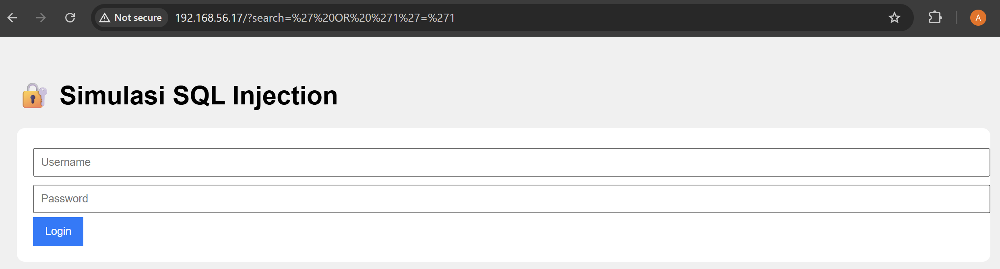
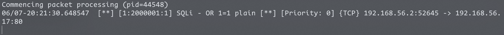
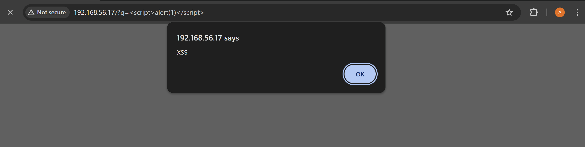
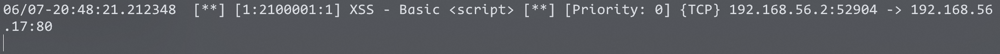

---

## 🧠 . Kesimpulan <a name="Kesimpulan"></a>

-

---

<p align="center"><em>Dokumentasi ini dibuat dengan semangat open source ❤️</em></p>


